# Zice Platform — Phase 1 & Phase 2 Technical Design Document

> **Codename:** Zice  
> **Domain (v1):** `zice.io` (configurable via env/config)  
> **Repositories:** `goruncoder/zice-frontend` (Next.js) · `goruncoder/zice-core` (Go API)  
> **Linear Project:** [Sports Management Platform](https://linear.app/neaa/project/sports-management-platform-279cb93ef2ca/overview)  
> **Hosting:** Vercel (frontend) · Railway (backend) · Cloudflare (DNS + custom domains) · Supabase (PostgreSQL + Auth)

---

## Table of Contents

1. [Executive Summary](#1-executive-summary)
2. [Architecture Overview](#2-architecture-overview)
3. [Identity Model: "Family-First Universal Passport"](#3-identity-model-family-first-universal-passport)
4. [Phase 1: Multi-Tenant Database Schema](#4-phase-1-multi-tenant-database-schema)
5. [Phase 1.5: Authentication & User Onboarding](#5-phase-15-authentication--user-onboarding)
6. [Phase 2: Roster Auditor Web Utility (Authenticated)](#6-phase-2-roster-auditor-web-utility-authenticated)
7. [API-First Architecture](#7-api-first-architecture)
8. [Multi-Tenant Routing & Middleware](#8-multi-tenant-routing--middleware)
9. [Project Structure & Repository Strategy](#9-project-structure--repository-strategy)
10. [Developer Experience (Makefile)](#10-developer-experience-makefile)
11. [Configuration & Branding Strategy](#11-configuration--branding-strategy)
12. [Security & Privacy](#12-security--privacy)
13. [CI/CD Notifications & Slack Integration](#13-cicd-notifications--slack-integration)
14. [Production Validation Smoke Tests](#14-production-validation-smoke-tests)
15. [Backend Service Roadmap](#15-backend-service-roadmap)
16. [Admin Import & Bulk Operations](#16-admin-import--bulk-operations)
17. [Universal Soft-Delete Policy](#17-universal-soft-delete-policy)
18. [Password Security & Passkey Authentication](#18-password-security--passkey-authentication)
19. [Admin Dashboard — Full CRUD](#19-admin-dashboard--full-crud)
20. [User Audit Log](#20-user-audit-log)
21. [Team Blog & Content Publishing](#21-team-blog--content-publishing)
22. [Platform Administration & Feature Gating](#22-platform-administration--feature-gating)
23. [Registration, Fees & Payment Processing](#23-registration-fees--payment-processing)
24. [Notifications System](#24-notifications-system)
25. [NGB Registration & Verification](#25-ngb-registration--verification)
26. [PR Breakdown Strategy](#26-pr-breakdown-strategy)

---

## 1. Executive Summary

Zice is a next-generation multi-tenant sports management platform built around the **"Family-First Universal Passport" identity model**. Unlike legacy systems with a single parent-owner, Zice treats players as independent entities with a flexible web of guardian connections — handling divorce/separation, grandparent access, carpool coordinators, and age-based autonomy transitions seamlessly.

Phase 1 establishes the PostgreSQL schema with strict Row Level Security (RLS). Phase 2 delivers a zero-friction, client-side Roster Auditor tool as a market-entry lead magnet.

---

## 2. Architecture Overview

### System Context Diagram

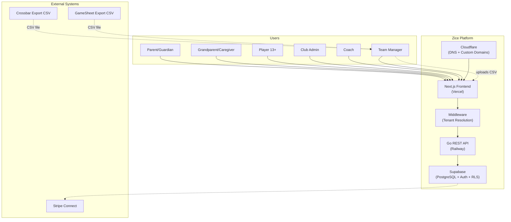
```mermaid
graph TB
    subgraph Users
        P[Parent/Guardian]
        GP[Grandparent/Caregiver]
        PL[Player 13+]
        A[Club Admin]
        C[Coach]
        TM[Team Manager]
    end

    subgraph "Zice Platform"
        FE["Next.js Frontend<br/>(Vercel)"]
        MW["Middleware<br/>(Tenant Resolution)"]
        API["Go REST API<br/>(Railway)"]
        SB["Supabase<br/>(PostgreSQL + Auth + RLS)"]
        CF["Cloudflare<br/>(DNS + Custom Domains)"]
    end

    subgraph "External Systems"
        CB[Crossbar Export CSV]
        GS[GameSheet Export CSV]
        ST[Stripe Connect]
    end

    P --> FE
    GP --> FE
    PL --> FE
    A --> FE
    C --> FE
    TM --> FE
    FE --> MW --> API --> SB
    CF --> FE
    TM -.->|uploads CSV| FE
    CB -.->|CSV file| TM
    GS -.->|CSV file| TM
    SB -.-> ST
```

---

## 3. Identity Model: "Family-First Universal Passport"

### 3.1 Core Design Principles

1. **Players are independent entities** — not "owned" by a single parent. A player can have multiple guardians with different permission levels.
2. **Family-first, player-controlled later** — Guardians manage everything initially. At age 13, the player gains limited autonomy (messaging). At 18, the player becomes the primary legal authority.
3. **No single gatekeeper** — In divorce/separation scenarios, both parents can have independent access. Neither can unilaterally lock out the other (only a club admin or legal order can revoke access).
4. **Extended access is first-class** — Grandparents, carpoolers, and babysitters can be granted scoped, read-only access without full guardian rights.
5. **Unified calendar aggregation** — Any user connected to multiple players sees all events in a single view.

### 3.2 Identity & Guardian Relationship Model

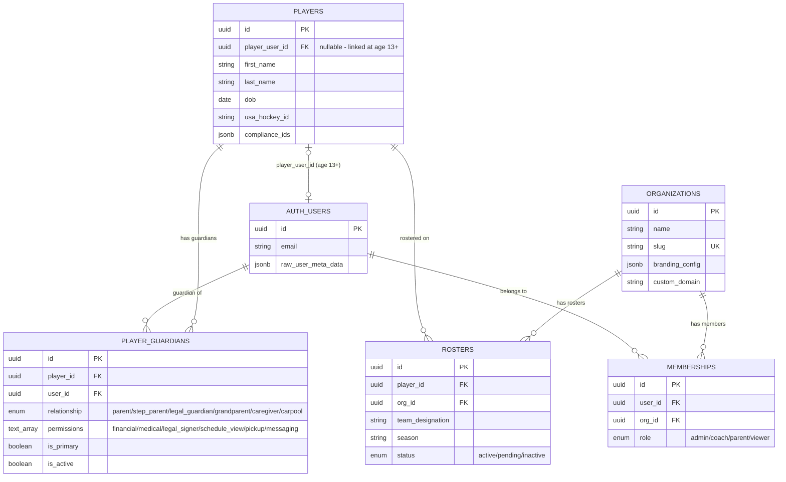
```mermaid
erDiagram
    AUTH_USERS ||--o{ PLAYER_GUARDIANS : "guardian of"
    AUTH_USERS ||--o{ MEMBERSHIPS : "belongs to"
    PLAYERS ||--o{ PLAYER_GUARDIANS : "has guardians"
    PLAYERS ||--o{ ROSTERS : "rostered on"
    PLAYERS |o--o| AUTH_USERS : "player_user_id (age 13+)"
    ORGANIZATIONS ||--o{ MEMBERSHIPS : "has members"
    ORGANIZATIONS ||--o{ ROSTERS : "has rosters"

    AUTH_USERS {
        uuid id PK
        string email
        jsonb raw_user_meta_data
    }

    PLAYERS {
        uuid id PK
        uuid player_user_id FK "nullable - linked at age 13+"
        string first_name
        string last_name
        date dob
        string usa_hockey_id
        jsonb compliance_ids
    }

    PLAYER_GUARDIANS {
        uuid id PK
        uuid player_id FK
        uuid user_id FK
        enum relationship "parent/step_parent/legal_guardian/grandparent/caregiver/carpool"
        text_array permissions "financial/medical/legal_signer/schedule_view/pickup/messaging"
        boolean is_primary
        boolean is_active
    }

    MEMBERSHIPS {
        uuid id PK
        uuid user_id FK
        uuid org_id FK
        enum role "admin/coach/parent/viewer"
    }

    ORGANIZATIONS {
        uuid id PK
        string name
        string slug UK
        jsonb branding_config
        string custom_domain
    }

    ROSTERS {
        uuid id PK
        uuid player_id FK
        uuid org_id FK
        string team_designation
        string season
        enum status "active/pending/inactive"
    }
```

### 3.3 Guardian Relationships & Permissions Matrix

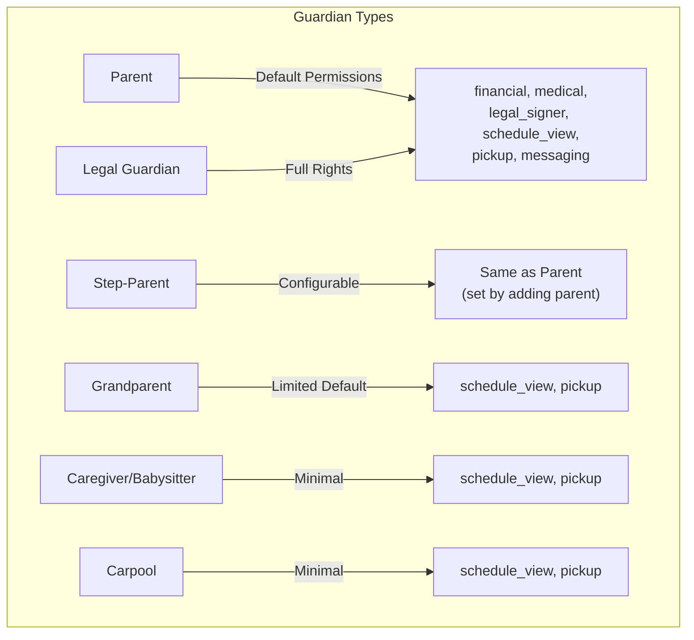
```mermaid
flowchart TD
    subgraph "Guardian Types"
        PR[Parent] --> |Default Permissions| FP["financial, medical,<br/>legal_signer, schedule_view,<br/>pickup, messaging"]
        SP[Step-Parent] --> |Configurable| CP["Same as Parent<br/>(set by adding parent)"]
        LG[Legal Guardian] --> |Full Rights| FP
        GP[Grandparent] --> |Limited Default| LP["schedule_view, pickup"]
        CG[Caregiver/Babysitter] --> |Minimal| MP["schedule_view, pickup"]
        CA[Carpool] --> |Minimal| RP["schedule_view, pickup"]
    end
```

**Permission Definitions:**

| Permission | Description | Who Gets It |
|---|---|---|
| `financial` | View/pay invoices, manage payment methods | Parent, Legal Guardian |
| `medical` | View/update medical info, emergency contacts | Parent, Legal Guardian |
| `legal_signer` | Sign waivers, agreements, registration forms | Parent, Legal Guardian (revoked from guardians at player age 18) |
| `schedule_view` | View practice/game schedules, receive reminders | All guardian types |
| `pickup` | Authorized for practice/game check-in/check-out | All guardian types |
| `messaging` | Receive coach/team messages about the player | Parent, Legal Guardian (player gains at 13+) |

### 3.4 Age-Based Autonomy Transitions

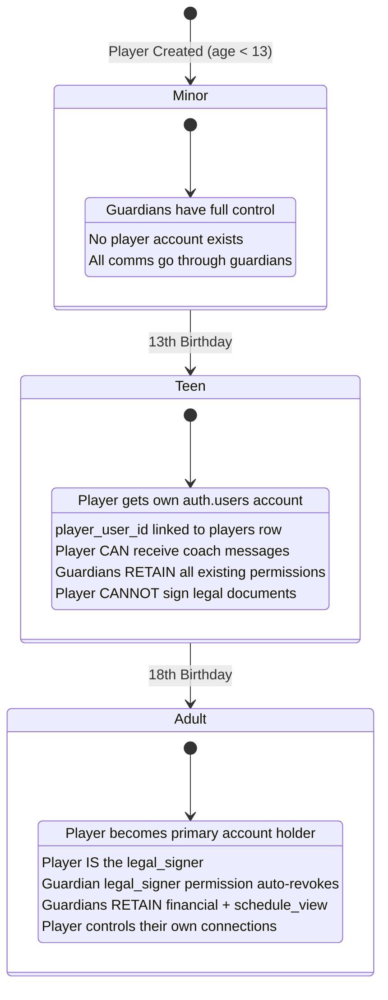
```mermaid
stateDiagram-v2
    [*] --> Minor: Player Created (age < 13)

    Minor --> Teen: 13th Birthday
    Teen --> Adult: 18th Birthday

    state Minor {
        [*] --> FullGuardianControl
        FullGuardianControl: Guardians have full control
        FullGuardianControl: No player account exists
        FullGuardianControl: All comms go through guardians
    }

    state Teen {
        [*] --> SharedControl
        SharedControl: Player gets own auth.users account
        SharedControl: player_user_id linked to players row
        SharedControl: Player CAN receive coach messages
        SharedControl: Guardians RETAIN all existing permissions
        SharedControl: Player CANNOT sign legal documents
    }

    state Adult {
        [*] --> PlayerPrimary
        PlayerPrimary: Player becomes primary account holder
        PlayerPrimary: Player IS the legal_signer
        PlayerPrimary: Guardian legal_signer permission auto-revokes
        PlayerPrimary: Guardians RETAIN financial + schedule_view
        PlayerPrimary: Player controls their own connections
    }
```

**Implementation Notes:**

- **Age calculation** is done via a SQL helper function: `get_player_age_tier(dob date) RETURNS text` — returns `'minor'`, `'teen'`, or `'adult'`.
- **Transition is computed, not stored** — we never store "age tier" as a column. RLS policies and application logic derive it from `dob` at query time.
- **At 13:** An admin or parent creates a Supabase auth account for the player and links `players.player_user_id`. The player can then log in and see their own schedule, receive coach messages.
- **At 18:** RLS policies automatically adjust — the player's own `auth.uid()` now has `legal_signer` equivalent access. Guardian `legal_signer` permissions are treated as revoked in policy evaluation (computed from `dob`, not from updating the `player_guardians` row).

### 3.5 Divorce/Separation Scenarios

| Scenario | How Zice Handles It |
|---|---|
| Both parents want access | Both are added as `player_guardians` with `relationship = 'parent'`. Both get full default permissions. Neither can remove the other. |
| One parent wants to block the other | **Not possible via the app.** Only a club admin can deactivate a guardian link (`is_active = false`), and only with a documented reason (e.g., court order). This is logged in an audit trail. |
| Financial split (e.g., 50/50) | Both parents have `financial` permission. Invoices can be split or assigned. The platform doesn't enforce payment allocation — the club admin manages this. |
| New step-parent added | Added as `player_guardians` with `relationship = 'step_parent'`. Permissions are explicitly configured by the adding parent or club admin. |

### 3.6 Unified Family Calendar Aggregation

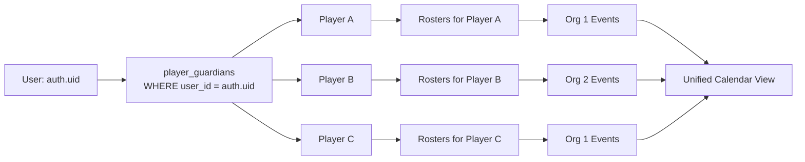
```mermaid
flowchart LR
    U[User: auth.uid] --> PG[player_guardians<br/>WHERE user_id = auth.uid]
    PG --> P1[Player A]
    PG --> P2[Player B]
    PG --> P3[Player C]
    P1 --> R1[Rosters for Player A]
    P2 --> R2[Rosters for Player B]
    P3 --> R3[Rosters for Player C]
    R1 --> E1[Org 1 Events]
    R2 --> E2[Org 2 Events]
    R3 --> E3[Org 1 Events]
    E1 --> CAL[Unified Calendar View]
    E2 --> CAL
    E3 --> CAL
```

A grandparent connected to 3 grandchildren across 2 clubs sees all events in one dashboard. The query path is:
```
auth.uid() -> player_guardians -> players -> rosters -> org events
```

---

## 4. Phase 1: Multi-Tenant Database Schema

### 4.1 Table Designs

#### `public.organizations`

| Column | Type | Constraints | Description |
|---|---|---|---|
| `id` | `uuid` | PK, default `gen_random_uuid()` | Tenant ID |
| `name` | `text` | NOT NULL | Display name (e.g., "Joliet Jaguars") |
| `slug` | `text` | UNIQUE, NOT NULL | URL-safe identifier (e.g., `joliet-jaguars`) |
| `branding_config` | `jsonb` | DEFAULT `'{}'` | Logo URL, primary/secondary colors, fonts |
| `stripe_connect_id` | `text` | NULLABLE | Stripe Connect merchant account |
| `custom_domain` | `text` | NULLABLE, UNIQUE | BYOD domain (e.g., `jolietjaguars.org`) |
| `contact_email` | `text` | NULLABLE | Primary org contact |
| `metadata` | `jsonb` | DEFAULT `'{}'` | Extensible org-specific metadata |
| `created_at` | `timestamptz` | DEFAULT `now()` | |
| `updated_at` | `timestamptz` | DEFAULT `now()` | |
| `deleted_at` | `timestamptz` | NULLABLE | Soft-delete timestamp; NULL = active |

#### `public.players`

| Column | Type | Constraints | Description |
|---|---|---|---|
| `id` | `uuid` | PK, default `gen_random_uuid()` | Player ID |
| `player_user_id` | `uuid` | FK -> `auth.users(id)`, NULLABLE, UNIQUE | Linked when player reaches age 13+ and gets their own account |
| `first_name` | `text` | NOT NULL | |
| `last_name` | `text` | NOT NULL | |
| `dob` | `date` | NOT NULL | Date of birth — used for age-tier computation |
| `usa_hockey_id` | `text` | NULLABLE, CHECK (14-char alphanumeric format) | Primary compliance ID |
| `compliance_ids` | `jsonb` | DEFAULT `'{}'` | Extensible: `{"usa_hockey": "...", "state_id": "..."}` |
| `created_at` | `timestamptz` | DEFAULT `now()` | |
| `updated_at` | `timestamptz` | DEFAULT `now()` | |
| `deleted_at` | `timestamptz` | NULLABLE | Soft-delete timestamp; NULL = active |

> **Note:** `usa_hockey_id` uses a CHECK constraint validating `^[A-Za-z0-9]{14}$` at input, but the column type is `text` (supports up to UUID-length) for future format changes. `player_user_id` is NULL for players under 13 and populated when they get their own Supabase auth account.

#### `public.player_guardians` *(NEW — replaces single parent_id FK)*

| Column | Type | Constraints | Description |
|---|---|---|---|
| `id` | `uuid` | PK, default `gen_random_uuid()` | |
| `player_id` | `uuid` | FK -> `players(id)`, NOT NULL | The player |
| `user_id` | `uuid` | FK -> `auth.users(id)`, NOT NULL | The guardian's global auth account |
| `relationship` | `text` | NOT NULL, CHECK in (`parent`, `step_parent`, `legal_guardian`, `grandparent`, `caregiver`, `carpool`) | Type of relationship |
| `permissions` | `text[]` | NOT NULL, DEFAULT `'{schedule_view}'` | Array of granted permissions |
| `is_primary` | `boolean` | NOT NULL, DEFAULT `false` | Primary contact for this player (at least one required) |
| `is_active` | `boolean` | NOT NULL, DEFAULT `true` | Soft-deactivate without deleting (for legal/audit trail) |
| `granted_by` | `uuid` | FK -> `auth.users(id)`, NULLABLE | Who added this guardian link |
| `created_at` | `timestamptz` | DEFAULT `now()` | |
| `updated_at` | `timestamptz` | DEFAULT `now()` | |

> **Unique constraint:** `(player_id, user_id)` — one relationship per guardian-player pair.  
> **CHECK constraint:** `permissions` values must be in `{financial, medical, legal_signer, schedule_view, pickup, messaging}`.  
> **Business rule (enforced in app layer):** At least one `player_guardians` row with `is_primary = true` must exist per player.

**Permission Defaults by Relationship:**

| Relationship | Default `permissions` |
|---|---|
| `parent` | `{financial, medical, legal_signer, schedule_view, pickup, messaging}` |
| `step_parent` | `{schedule_view, pickup, messaging}` (configurable by adding parent/admin) |
| `legal_guardian` | `{financial, medical, legal_signer, schedule_view, pickup, messaging}` |
| `grandparent` | `{schedule_view, pickup}` |
| `caregiver` | `{schedule_view, pickup}` |
| `carpool` | `{schedule_view, pickup}` |

#### `public.memberships`

| Column | Type | Constraints | Description |
|---|---|---|---|
| `id` | `uuid` | PK, default `gen_random_uuid()` | |
| `user_id` | `uuid` | FK -> `auth.users(id)`, NOT NULL | Global user identity |
| `org_id` | `uuid` | FK -> `organizations(id)`, NOT NULL | Tenant |
| `role` | `text` | NOT NULL, CHECK in (`admin`, `coach`, `parent`, `viewer`) | Structural role within the org |
| `joined_at` | `timestamptz` | DEFAULT `now()` | |
| `created_at` | `timestamptz` | DEFAULT `now()` | |
| `updated_at` | `timestamptz` | DEFAULT `now()` | |
| `deleted_at` | `timestamptz` | NULLABLE | Soft-delete timestamp; NULL = active |

> **Unique constraint:** `(user_id, org_id)` — one role per user per org.

#### `public.rosters`

| Column | Type | Constraints | Description |
|---|---|---|---|
| `id` | `uuid` | PK, default `gen_random_uuid()` | |
| `player_id` | `uuid` | FK -> `players(id)`, NOT NULL | |
| `org_id` | `uuid` | FK -> `organizations(id)`, NOT NULL | |
| `team_designation` | `text` | NOT NULL | e.g., "14U Gold", "12U Silver" |
| `season` | `text` | NOT NULL | e.g., "2025-2026" |
| `jersey_number` | `text` | NULLABLE | Player's jersey number for this roster |
| `status` | `text` | NOT NULL, CHECK in (`active`, `pending`, `inactive`) | |
| `created_at` | `timestamptz` | DEFAULT `now()` | |
| `updated_at` | `timestamptz` | DEFAULT `now()` | |
| `deleted_at` | `timestamptz` | NULLABLE | Soft-delete timestamp; NULL = active |

> **Unique constraint:** `(player_id, org_id, team_designation, season)` — a player appears once per team per season.

### 4.2 Row Level Security (RLS) Policies

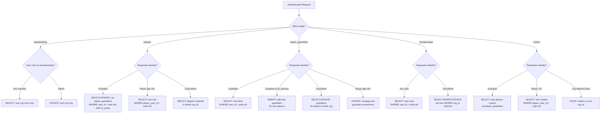
```mermaid
flowchart TD
    A[Authenticated Request] --> B{Which table?}

    B -->|organizations| C{User role via memberships?}
    C -->|Any member| D[SELECT: own org rows only]
    C -->|Admin| E[UPDATE: own org only]

    B -->|players| F{Requestor identity?}
    F -->|Guardian| G["SELECT/UPDATE: via player_guardians<br/>WHERE user_id = auth.uid AND is_active"]
    F -->|Player age 13+| G2["SELECT own row<br/>WHERE player_user_id = auth.uid"]
    F -->|Club Admin| H["SELECT: players rostered<br/>in admin org_id"]

    B -->|player_guardians| PG{Requestor identity?}
    PG -->|Guardian| PG1["SELECT: own links<br/>WHERE user_id = auth.uid"]
    PG -->|Guardian w/ is_primary| PG2["INSERT: add new guardians<br/>for own players"]
    PG -->|Org Admin| PG3["SELECT/UPDATE: guardians<br/>for players in their org"]
    PG -->|Player age 18+| PG4["UPDATE: manage own<br/>guardian connections"]

    B -->|memberships| I{Requestor identity?}
    I -->|Any user| J["SELECT: own rows<br/>WHERE user_id = auth.uid"]
    I -->|Org Admin| K["SELECT/INSERT/UPDATE:<br/>all rows WHERE org_id matches"]

    B -->|rosters| L{Requestor identity?}
    L -->|Guardian| M["SELECT: own players rosters<br/>via player_guardians"]
    L -->|Player 13+| M2["SELECT: own rosters<br/>WHERE player_user_id = auth.uid"]
    L -->|Org Admin/Coach| N[CRUD: rosters in own org_id]
```

**Policy Summary:**

| Table | Operation | Policy Name | Filter |
|---|---|---|---|
| `organizations` | SELECT | `org_member_select` | `EXISTS (membership for auth.uid() + org.id)` |
| `organizations` | UPDATE | `org_admin_update` | `EXISTS (membership with role='admin' for auth.uid() + org.id)` |
| `players` | SELECT | `guardian_select_players` | `EXISTS (player_guardians WHERE user_id = auth.uid() AND is_active)` |
| `players` | SELECT | `player_self_select` | `player_user_id = auth.uid()` (for teen/adult players) |
| `players` | SELECT | `org_admin_select_players` | `EXISTS (roster in admin's org)` |
| `players` | INSERT | `guardian_insert_players` | `auth.uid()` will be added as primary guardian (enforced in app layer) |
| `players` | INSERT | `admin_insert_players` | Admin of any org can create players (org link via `rosters`) |
| `players` | UPDATE | `guardian_update_players` | `EXISTS (player_guardians WHERE user_id = auth.uid() AND is_active AND permissions @> '{medical}')` |
| `players` | UPDATE | `admin_update_players` | Admin can update players rostered in their org |
| `player_guardians` | SELECT | `guardian_select_own` | `user_id = auth.uid()` |
| `player_guardians` | SELECT | `org_admin_select_guardians` | Admin of an org where player is rostered |
| `player_guardians` | INSERT | `primary_guardian_insert` | `EXISTS (player_guardians WHERE user_id = auth.uid() AND is_primary AND player_id = NEW.player_id)` |
| `player_guardians` | INSERT | `admin_insert_guardians` | Admin can create guardian links for players rostered in their org |
| `player_guardians` | UPDATE | `admin_update_guardians` | Org admin only (for deactivation with audit) |
| `player_guardians` | UPDATE | `adult_player_manage_own` | `player_user_id = auth.uid() AND get_player_age_tier(dob) = 'adult'` |
| `memberships` | SELECT | `user_select_own` | `user_id = auth.uid()` |
| `memberships` | SELECT/INSERT/UPDATE | `org_admin_manage` | `role = 'admin'` for same `org_id` |
| `rosters` | SELECT | `guardian_select_rosters` | `EXISTS (player_guardians for auth.uid() -> player_id)` |
| `rosters` | SELECT | `player_self_select_rosters` | `EXISTS (players WHERE player_user_id = auth.uid() AND id = roster.player_id)` |
| `rosters` | ALL | `org_staff_manage_rosters` | `EXISTS (membership with role in ('admin','coach') for auth.uid() + org_id)` |

### 4.3 Helper Functions

| Function | Returns | Description |
|---|---|---|
| `get_player_age_tier(dob date)` | `text` | Returns `'minor'` (< 13), `'teen'` (13-17), or `'adult'` (18+) based on current date |
| `is_guardian_of(user_uuid uuid, player_uuid uuid)` | `boolean` | Active guardian check via `player_guardians` |
| `guardian_has_permission(user_uuid uuid, player_uuid uuid, perm text)` | `boolean` | Check specific permission, factoring in age-based overrides |
| `get_user_org_ids(user_uuid uuid)` | `uuid[]` | All `org_id`s where user has a membership |
| `is_org_admin(user_uuid uuid, org_uuid uuid)` | `boolean` | Admin role check |
| `is_org_member(user_uuid uuid, org_uuid uuid)` | `boolean` | Any role check |

> **`guardian_has_permission` special logic:** If checking `legal_signer` and the player's age tier is `'adult'`, returns `false` for guardians — only the player themselves (via `player_user_id`) can be legal signer.

### 4.4 Indexes

- `organizations(slug)` — B-tree unique index for tenant resolution
- `organizations(custom_domain)` — B-tree unique partial index (WHERE custom_domain IS NOT NULL) for BYOD domain lookup
- `players(player_user_id)` — B-tree unique partial index (WHERE player_user_id IS NOT NULL) for teen/adult player login
- `player_guardians(player_id, user_id)` — Composite unique index
- `player_guardians(user_id)` — For "show me all my players" queries (family calendar)
- `player_guardians(player_id) WHERE is_active = true` — For "who are this player's guardians" queries
- `memberships(user_id, org_id)` — Composite unique index
- `memberships(org_id)` — For admin queries listing org members
- `rosters(org_id, team_designation, season)` — For team roster lookups
- `rosters(player_id)` — For player history lookups

### 4.5 Guardian Audit Log

#### `public.guardian_audit_log`

| Column | Type | Constraints | Description |
|---|---|---|---|
| `id` | `uuid` | PK, default `gen_random_uuid()` | |
| `player_guardian_id` | `uuid` | FK -> `player_guardians(id)`, NOT NULL | The guardian link affected |
| `action` | `text` | NOT NULL, CHECK in (`deactivated`, `reactivated`, `permissions_changed`) | What happened |
| `reason` | `text` | NULLABLE | Why (e.g., "Court order #12345", "Custody change") |
| `performed_by` | `uuid` | FK -> `auth.users(id)`, NOT NULL | Who performed the action (admin user) |
| `previous_state` | `jsonb` | NOT NULL | Snapshot of the row before the change |
| `created_at` | `timestamptz` | DEFAULT `now()` | |

> This table is **append-only** (INSERT only, no UPDATE/DELETE). RLS allows org admins to SELECT audit logs for guardians of players rostered in their org.

### 4.6 Triggers

- `set_updated_at()` — Auto-update trigger on all five core tables.
- `ensure_primary_guardian()` — After DELETE/UPDATE on `player_guardians`, validate at least one `is_primary = true` row remains per player. If violated, raise an exception to prevent the operation.

---

## 5. Phase 1.5: Authentication & User Onboarding

### 5.1 Overview

All platform features — including the Roster Auditor — require authentication. Supabase Auth handles account creation, session management, and JWT issuance. The Go API validates JWTs and enforces RLS.

### 5.2 Supported Auth Methods

| Method | Description | Phase |
|---|---|---|
| Email + Password | Standard signup with email verification | Phase 1.5 (now) |
| Magic Link | Passwordless email login | Phase 1.5 (now) |
| OAuth (Google) | Social login for convenience | Phase 1.5 (now) |
| OAuth (Apple) | Required for iOS in future | Future |

### 5.3 Signup & Onboarding Flow

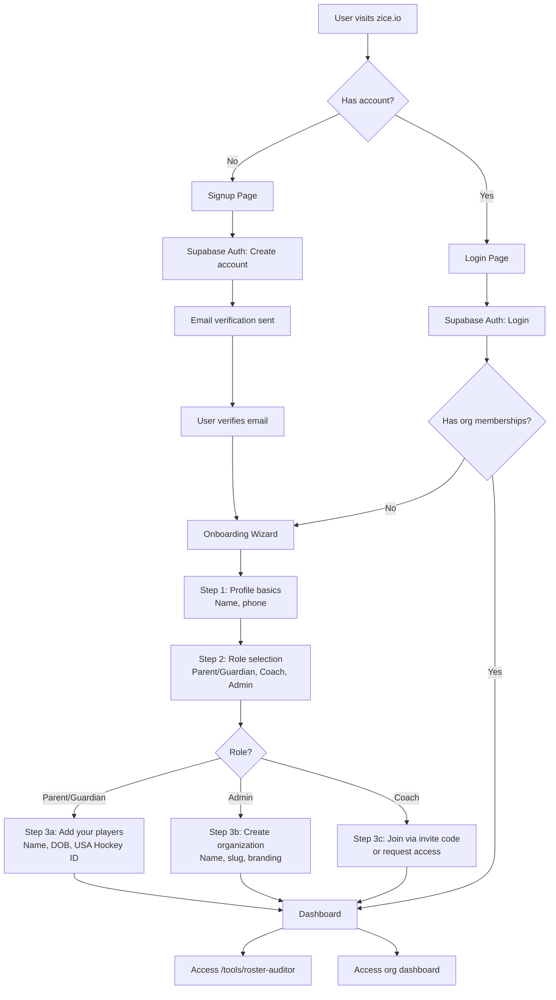
```mermaid
flowchart TD
    A[User visits zice.io] --> B{Has account?}
    B -->|No| C[Signup Page]
    B -->|Yes| D[Login Page]

    C --> E[Supabase Auth: Create account]
    E --> F[Email verification sent]
    F --> G[User verifies email]
    G --> H[Onboarding Wizard]

    D --> I[Supabase Auth: Login]
    I --> J{Has org memberships?}

    H --> H1[Step 1: Profile basics<br/>Name, phone]
    H1 --> H2[Step 2: Role selection<br/>Parent/Guardian, Coach, Admin]
    H2 --> H3{Role?}
    H3 -->|Parent/Guardian| H4[Step 3a: Add your players<br/>Name, DOB, USA Hockey ID]
    H3 -->|Admin| H5[Step 3b: Create organization<br/>Name, slug, branding]
    H3 -->|Coach| H6[Step 3c: Join via invite code<br/>or request access]
    H4 --> K[Dashboard]
    H5 --> K
    H6 --> K

    J -->|Yes| K
    J -->|No| H

    K --> L[Access /tools/roster-auditor]
    K --> M[Access org dashboard]
```

### 5.4 Invite-Based Onboarding

Club admins can invite users to their organization:

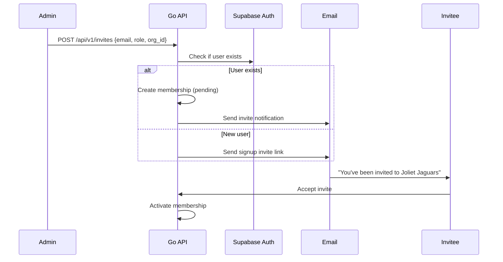
```mermaid
sequenceDiagram
    participant Admin
    participant API as Go API
    participant SB as Supabase Auth
    participant Email
    participant Invitee

    Admin->>API: POST /api/v1/invites {email, role, org_id}
    API->>SB: Check if user exists
    alt User exists
        API->>API: Create membership (pending)
        API->>Email: Send invite notification
    else New user
        API->>Email: Send signup invite link
    end
    Email->>Invitee: "You've been invited to Joliet Jaguars"
    Invitee->>API: Accept invite
    API->>API: Activate membership
```

### 5.5 Auth API Endpoints (zice-core)

```
# Auth (proxy to Supabase + custom logic)
POST   /api/v1/auth/signup                # Email+password signup (wraps Supabase)
POST   /api/v1/auth/login                 # Email+password login
POST   /api/v1/auth/magic-link            # Send magic link email
POST   /api/v1/auth/refresh               # Refresh access token
POST   /api/v1/auth/logout                # Invalidate session
GET    /api/v1/auth/me                     # Get current user profile
PUT    /api/v1/auth/me                     # Update profile (name, phone)

# Invites
POST   /api/v1/invites                    # Create invite (admin)
GET    /api/v1/invites/:token             # Validate invite token
POST   /api/v1/invites/:token/accept      # Accept invite
```

### 5.6 Session Management

- **Supabase handles JWT issuance** — access token (short-lived, 1hr) + refresh token (long-lived, 30 days)
- **Frontend stores tokens** via `@supabase/ssr` cookie helpers in Next.js
- **Middleware checks auth** — unauthenticated users are redirected to `/login`
- **Protected routes**: Everything except `/login`, `/signup`, `/invite/:token`, and static assets
- **`/tools/roster-auditor`** requires authentication — user must be logged in to access

### 5.7 Frontend Auth Components

```
app/
├── (auth)/
│   ├── login/page.tsx              # Email/password + magic link + OAuth
│   ├── signup/page.tsx             # Registration form
│   ├── verify/page.tsx             # Email verification landing
│   └── invite/[token]/page.tsx     # Invite acceptance
├── (onboarding)/
│   └── onboarding/page.tsx         # Multi-step wizard
├── (protected)/
│   ├── dashboard/page.tsx          # Main dashboard
│   └── tools/
│       └── roster-auditor/page.tsx  # Gated behind auth
└── layout.tsx                       # Auth provider wrapper
```

---

## 6. Phase 2: Roster Auditor Web Utility (Authenticated)

### 6.1 Overview

An **authenticated, 100% client-side** utility at `/tools/roster-auditor`. Users must be logged in to access it. No player CSV data leaves the browser — all parsing happens locally. This is the market-entry "lead magnet" for team managers.

> **Change from original design:** The Roster Auditor now requires login. This allows us to track usage, associate audit results with a user/org context, and gate access for future premium features.

### 6.2 User Flow

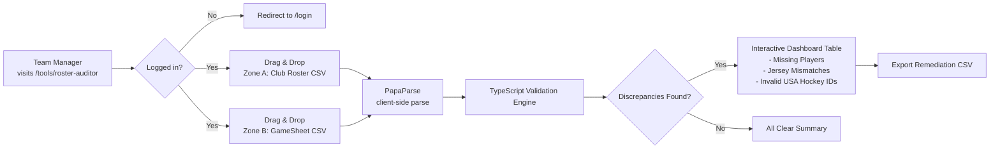
```mermaid
flowchart LR
    A[Team Manager<br/>visits /tools/roster-auditor] --> AA{Logged in?}
    AA -->|No| AB[Redirect to /login]
    AA -->|Yes| B[Drag & Drop<br/>Zone A: Club Roster CSV]
    AA -->|Yes| C[Drag & Drop<br/>Zone B: GameSheet CSV]
    B --> D[PapaParse<br/>client-side parse]
    C --> D
    D --> E[TypeScript Validation Engine]
    E --> F{Discrepancies Found?}
    F -->|Yes| G[Interactive Dashboard Table<br/>- Missing Players<br/>- Jersey Mismatches<br/>- Invalid USA Hockey IDs]
    F -->|No| H[All Clear Summary]
    G --> I[Export Remediation CSV]
```

### 6.3 Expected CSV Formats

Based on the crossbar-extractor data model and known GameSheet exports:

**Zone A — Club Roster CSV (Crossbar/CrossIce export):**

| Column | Required | Notes |
|---|---|---|
| `First Name` or `Player First Name` | Yes | Case-insensitive header matching |
| `Last Name` or `Player Last Name` | Yes | |
| `Jersey` or `Jersey Number` or `Number` | Yes | |
| `USA Hockey Number` or `USA Hockey ID` or `USA Hockey #` | Optional | 14-char alphanumeric |

> The parser auto-detects column mapping by normalizing headers.

**Zone B — GameSheet System CSV:**

| Column | Required | Notes |
|---|---|---|
| `Player Name` or `Name` | Yes | May be "Last, First" or "First Last" |
| `Jersey Number` or `Jersey` or `#` | Yes | |

### 6.4 Matching & Validation Engine

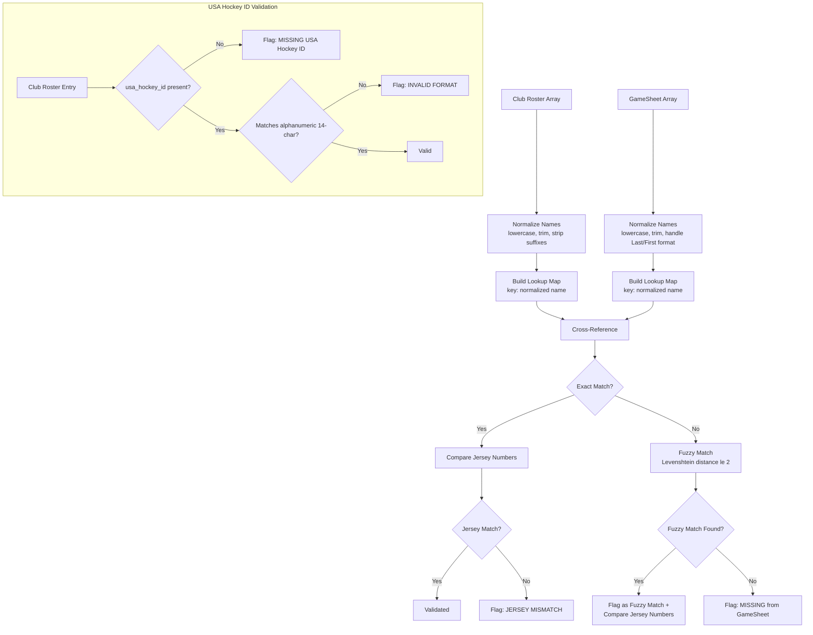
```mermaid
flowchart TD
    A[Club Roster Array] --> B[Normalize Names<br/>lowercase, trim, strip suffixes]
    C[GameSheet Array] --> D[Normalize Names<br/>lowercase, trim, handle Last/First format]

    B --> E[Build Lookup Map<br/>key: normalized name]
    D --> F[Build Lookup Map<br/>key: normalized name]

    E --> G[Cross-Reference]
    F --> G

    G --> H{Exact Match?}
    H -->|Yes| I[Compare Jersey Numbers]
    H -->|No| J[Fuzzy Match<br/>Levenshtein distance le 2]

    J --> K{Fuzzy Match Found?}
    K -->|Yes| L[Flag as Fuzzy Match +<br/>Compare Jersey Numbers]
    K -->|No| M[Flag: MISSING from GameSheet]

    I --> N{Jersey Match?}
    N -->|Yes| O[Validated]
    N -->|No| P[Flag: JERSEY MISMATCH]

    subgraph "USA Hockey ID Validation"
        Q[Club Roster Entry] --> R{usa_hockey_id present?}
        R -->|No| S[Flag: MISSING USA Hockey ID]
        R -->|Yes| T{Matches alphanumeric 14-char?}
        T -->|No| U[Flag: INVALID FORMAT]
        T -->|Yes| V[Valid]
    end
```

**Discrepancy Types:**

| Code | Type | Description |
|---|---|---|
| `MISSING_FROM_GAMESHEET` | Discrepancy A | Player in Club CSV but not in GameSheet |
| `MISSING_FROM_CLUB` | Discrepancy A (reverse) | Player in GameSheet but not in Club CSV |
| `JERSEY_MISMATCH` | Discrepancy B | Same player, different jersey numbers |
| `MISSING_USA_HOCKEY_ID` | Discrepancy C | Blank/null USA Hockey ID |
| `INVALID_USA_HOCKEY_ID` | Discrepancy C | Doesn't match `^[A-Za-z0-9]{14}$` |

### 6.5 UI Components

```
/tools/roster-auditor
├── RosterAuditorPage          (page.tsx — server component shell)
├── RosterAuditorClient        (client component orchestrator)
│   ├── FileDropZone            (reusable drag-and-drop CSV upload)
│   ├── ParsingStatus           (loading/error states per zone)
│   ├── DiscrepancyDashboard    (results container)
│   │   ├── SummaryCards         (count cards: missing, mismatched, invalid)
│   │   ├── DiscrepancyTable     (sortable, filterable table)
│   │   └── ExportButton         (CSV download of flagged rows)
│   └── PrivacyBanner           (prominent "No data leaves your browser" notice)
```

### 6.6 Fuzzy Matching Algorithm

**Levenshtein distance** with a threshold of <= 2 edits after normalization:

1. Lowercase both strings
2. Trim whitespace
3. Remove common suffixes: `jr`, `jr.`, `sr`, `sr.`, `ii`, `iii`, `iv`
4. Normalize "Last, First" -> "First Last"
5. Compare: if Levenshtein distance <= 2 -> fuzzy match

For the CSV audit, we first attempt exact normalized match, then fall back to fuzzy.

---

## 7. API-First Architecture

The frontend (`zice-frontend`) is a **pure API consumer**. All data interactions go through the Go REST API (`zice-core`). No hidden coupling or framework-specific server actions are used for data mutations.

### 7.1 API Design Principles

- **OpenAPI/Swagger documented**: Every endpoint has a machine-readable spec. Auto-generated from Go code annotations.
- **Versioned**: All endpoints prefixed with `/api/v1/`. Breaking changes require a new version.
- **Consistent response format**: All responses follow `{data, error, meta}` envelope pattern.
- **Auth via Supabase JWT**: Frontend passes the Supabase access token as `Authorization: Bearer <token>`. The Go API validates the JWT and extracts `user_id`.
- **Tenant-scoped**: Most endpoints require an `X-Org-ID` header for multi-tenant context.

### 7.2 Phase 1 API Endpoints (zice-core)

```
# Auth (see Section 5.5 for full auth endpoints)
POST   /api/v1/auth/signup                # Email+password signup
POST   /api/v1/auth/login                 # Login
POST   /api/v1/auth/magic-link            # Magic link
GET    /api/v1/auth/me                     # Current user profile

# Invites
POST   /api/v1/invites                    # Create invite (admin)
POST   /api/v1/invites/:token/accept      # Accept invite

# Organizations
GET    /api/v1/organizations              # List user's orgs (via memberships)
GET    /api/v1/organizations/:slug        # Get org by slug (public info + branding)
PUT    /api/v1/organizations/:id          # Update org (admin only)

# Players
GET    /api/v1/players                    # List guardian's players
POST   /api/v1/players                    # Create player (auto-adds guardian link)
GET    /api/v1/players/:id                # Get player detail
PUT    /api/v1/players/:id                # Update player

# Player Guardians
GET    /api/v1/players/:id/guardians      # List guardians for a player
POST   /api/v1/players/:id/guardians      # Add guardian (primary guardian or admin)
PUT    /api/v1/guardians/:id              # Update guardian permissions
PUT    /api/v1/guardians/:id/deactivate   # Deactivate guardian (admin, with reason)
PUT    /api/v1/guardians/:id/reactivate   # Reactivate guardian (admin, with reason)

# Memberships
GET    /api/v1/memberships                # List user's memberships
POST   /api/v1/memberships                # Invite user to org (admin)
PUT    /api/v1/memberships/:id            # Update role (admin)

# Rosters
GET    /api/v1/rosters                    # List rosters (scoped by org + query params)
POST   /api/v1/rosters                    # Add player to roster (admin/coach)
PUT    /api/v1/rosters/:id                # Update roster entry

# Admin Bulk Import (admin only)
POST   /api/v1/orgs/:id/import/roster     # Bulk import players + roster entries from CSV
POST   /api/v1/orgs/:id/import/guardians  # Bulk import guardian links from CSV
GET    /api/v1/orgs/:id/import/history     # View past import jobs + results

# Admin org-scoped operations
POST   /api/v1/orgs/:id/players           # Admin creates player within org context
POST   /api/v1/orgs/:id/players/:pid/guardians  # Admin links guardian to org player

# Tenant Resolution (used by middleware)
GET    /api/v1/tenants/resolve?domain=... # Resolve custom domain -> org slug

# Health
GET    /api/v1/health                     # Liveness check
```

### 7.3 Frontend-to-API Communication

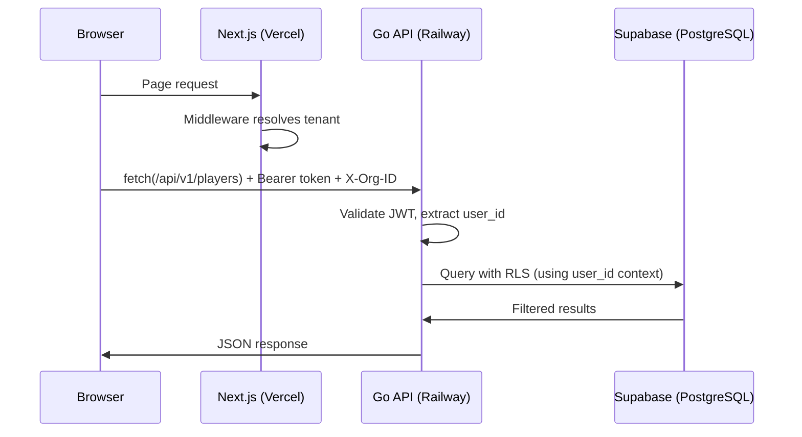
```mermaid
sequenceDiagram
    participant Browser
    participant NextJS as Next.js (Vercel)
    participant API as Go API (Railway)
    participant DB as Supabase (PostgreSQL)

    Browser->>NextJS: Page request
    NextJS->>NextJS: Middleware resolves tenant
    Browser->>API: fetch(/api/v1/players) + Bearer token + X-Org-ID
    API->>API: Validate JWT, extract user_id
    API->>DB: Query with RLS (using user_id context)
    DB->>API: Filtered results
    API->>Browser: JSON response
```

> **Note:** The Roster Auditor (Phase 2) requires authentication but does NOT transmit CSV data to the API — all parsing is 100% client-side. The auth check simply validates the user's session.

---

## 8. Multi-Tenant Routing & Middleware

### 8.1 Tenant Resolution Strategy

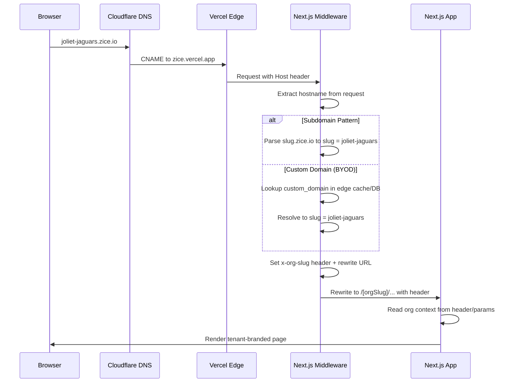
```mermaid
sequenceDiagram
    participant Browser
    participant Cloudflare as Cloudflare DNS
    participant Vercel as Vercel Edge
    participant MW as Next.js Middleware
    participant App as Next.js App

    Browser->>Cloudflare: joliet-jaguars.zice.io
    Cloudflare->>Vercel: CNAME to zice.vercel.app
    Vercel->>MW: Request with Host header

    MW->>MW: Extract hostname from request
    alt Subdomain Pattern
        MW->>MW: Parse slug.zice.io to slug = joliet-jaguars
    else Custom Domain (BYOD)
        MW->>MW: Lookup custom_domain in edge cache/DB
        MW->>MW: Resolve to slug = joliet-jaguars
    end

    MW->>MW: Set x-org-slug header + rewrite URL
    MW->>App: Rewrite to /[orgSlug]/... with header

    App->>App: Read org context from header/params
    App->>Browser: Render tenant-branded page
```

### 8.2 Middleware Implementation Plan

The Next.js middleware (`middleware.ts`) at the project root will:

1. **Extract the hostname** from the incoming request's `Host` header.
2. **Check against the root domain** (configurable via `NEXT_PUBLIC_ROOT_DOMAIN` env var, default `zice.io`):
   - If `hostname === rootDomain` or `hostname === 'www.' + rootDomain` -> **marketing site**, pass through.
   - If `hostname === 'app.' + rootDomain` -> **authenticated app**, pass through.
   - If `hostname.endsWith('.' + rootDomain)` -> **subdomain tenant**: extract slug from subdomain.
   - Otherwise -> **custom domain BYOD**: resolve slug via API/edge cache lookup.
3. **Rewrite the request** to internal path `/org/[slug]/...` with an `x-org-slug` header.
4. **Authenticated tool routes** like `/tools/roster-auditor` require login but are excluded from tenant resolution (served from the root domain).

### 8.3 BYOD Custom Domain Flow

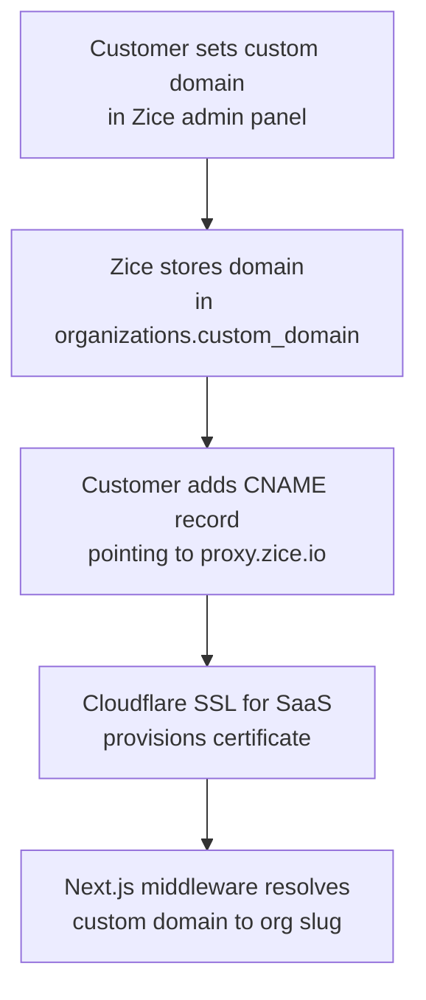
```mermaid
flowchart TD
    A[Customer sets custom domain<br/>in Zice admin panel] --> B[Zice stores domain<br/>in organizations.custom_domain]
    B --> C[Customer adds CNAME record<br/>pointing to proxy.zice.io]
    C --> D[Cloudflare SSL for SaaS<br/>provisions certificate]
    D --> E[Next.js middleware resolves<br/>custom domain to org slug]
```

For BYOD:
- Customer configures their DNS to CNAME to `proxy.zice.io` (or their subdomain).
- Cloudflare for SaaS handles SSL certificate provisioning.
- Middleware checks the `custom_domain` column for resolution.
- An API endpoint allows admins to set/update their custom domain.

---

## 9. Project Structure & Repository Strategy

### 9.1 Repository: `zice-frontend` (Next.js)

```
zice-frontend/
├── .github/
│   └── workflows/             # CI/CD (Vercel deployment)
├── public/
├── src/
│   ├── app/
│   │   ├── layout.tsx                    # Auth provider wrapper
│   │   ├── page.tsx                      # Marketing landing
│   │   ├── (auth)/
│   │   │   ├── login/page.tsx            # Email/password + magic link + OAuth
│   │   │   ├── signup/page.tsx           # Registration form
│   │   │   ├── verify/page.tsx           # Email verification landing
│   │   │   └── invite/[token]/page.tsx   # Invite acceptance
│   │   ├── (onboarding)/
│   │   │   └── onboarding/page.tsx       # Multi-step wizard
│   │   ├── (protected)/
│   │   │   ├── dashboard/page.tsx        # Main dashboard
│   │   │   └── tools/
│   │   │       └── roster-auditor/
│   │   │           └── page.tsx          # Phase 2: Auditor (auth gated)
│   │   └── org/
│   │       └── [slug]/
│   │           └── ...                   # Tenant-scoped routes (future)
│   ├── components/
│   │   ├── ui/                           # Shared UI primitives
│   │   ├── auth/                         # Auth components
│   │   │   ├── LoginForm.tsx
│   │   │   ├── SignupForm.tsx
│   │   │   ├── OAuthButtons.tsx
│   │   │   └── OnboardingWizard.tsx
│   │   └── roster-auditor/               # Phase 2 components
│   │       ├── FileDropZone.tsx
│   │       ├── DiscrepancyDashboard.tsx
│   │       ├── DiscrepancyTable.tsx
│   │       ├── SummaryCards.tsx
│   │       └── ExportButton.tsx
│   ├── lib/
│   │   ├── config.ts                     # Branding & domain config
│   │   ├── api/
│   │   │   └── client.ts                 # Typed API client for zice-core
│   │   ├── supabase/
│   │   │   ├── client.ts                 # Browser client
│   │   │   ├── server.ts                 # Server client (for server components)
│   │   │   └── middleware.ts             # Supabase auth middleware helper
│   │   └── roster-auditor/
│   │       ├── parser.ts                 # PapaParse wrapper
│   │       ├── matcher.ts               # Fuzzy matching engine
│   │       ├── validator.ts             # USA Hockey ID validation
│   │       └── types.ts                 # TypeScript interfaces
│   ├── middleware.ts                     # Auth check + Tenant resolution
│   └── styles/
│       └── globals.css
├── Makefile
├── Dockerfile
├── docker-compose.yml
├── tailwind.config.ts
├── next.config.ts
├── tsconfig.json
├── .env.example
└── package.json
```

### 9.2 Repository: `zice-core` (Go API)

```
zice-core/
├── .github/
│   └── workflows/             # CI/CD (Railway deployment)
├── cmd/
│   └── server/
│       └── main.go            # Application entrypoint
├── internal/
│   ├── api/
│   │   ├── router.go          # HTTP router setup + middleware
│   │   ├── handlers/
│   │   │   ├── auth.go            # Auth endpoints (signup, login, magic link)
│   │   │   ├── invites.go         # Invite endpoints
│   │   │   ├── organizations.go
│   │   │   ├── players.go
│   │   │   ├── guardians.go
│   │   │   ├── memberships.go
│   │   │   ├── rosters.go
│   │   │   ├── tenants.go
│   │   │   └── health.go
│   │   └── middleware/
│   │       ├── auth.go        # JWT validation
│   │       ├── tenant.go      # X-Org-ID extraction
│   │       └── cors.go
│   ├── domain/
│   │   ├── user.go            # Domain models
│   │   ├── invite.go
│   │   ├── organization.go
│   │   ├── player.go
│   │   ├── guardian.go
│   │   ├── membership.go
│   │   └── roster.go
│   ├── repository/
│   │   ├── user.go            # DB access layer
│   │   ├── invite.go
│   │   ├── organization.go
│   │   ├── player.go
│   │   ├── guardian.go
│   │   ├── membership.go
│   │   └── roster.go
│   └── service/
│       ├── auth.go            # Business logic
│       ├── invite.go
│       ├── organization.go
│       ├── player.go
│       ├── guardian.go
│       ├── membership.go
│       └── roster.go
├── supabase/
│   ├── config.toml
│   └── migrations/
│       ├── 00001_foundation_schema.sql   # Phase 1: tables + indexes + triggers
│       └── 00002_rls_policies.sql        # Phase 1: RLS + helper functions
├── docs/
│   └── openapi.yaml                     # OpenAPI 3.0 spec (auto-generated)
├── Makefile
├── Dockerfile
├── docker-compose.yml                   # Local dev: API + PostgreSQL + Supabase
├── go.mod
├── go.sum
└── .env.example
```

---

## 10. Developer Experience (Makefile)

Both repos include a `Makefile` for consistent development workflows:

### `zice-core` Makefile Targets

| Target | Command | Description |
|---|---|---|
| `make dev` | `docker compose up` | Starts Go API + PostgreSQL + Supabase locally |
| `make test` | `go test ./...` | Runs all unit tests |
| `make check` | `make lint && make test` | Lint + tests (pre-merge gate) |
| `make lint` | `golangci-lint run` | Go linting |
| `make migrate` | `supabase db push` | Apply migrations to local Supabase |
| `make generate` | `swag init` | Regenerate OpenAPI spec from annotations |
| `make build` | `go build ./cmd/server` | Compile the binary |

### `zice-frontend` Makefile Targets

| Target | Command | Description |
|---|---|---|
| `make dev` | `docker compose up` | Starts Next.js dev server in Docker |
| `make test` | `npm test` | Runs all unit tests (Vitest) |
| `make check` | `make lint && make typecheck && make test` | Lint + typecheck + tests (pre-merge gate) |
| `make lint` | `npm run lint` | ESLint |
| `make typecheck` | `npx tsc --noEmit` | TypeScript type checking |
| `make build` | `npm run build` | Production build |

---

## 11. Configuration & Branding Strategy

All branding/domain values are configurable and never hardcoded:

```typescript
// lib/config.ts
export const platformConfig = {
  name: process.env.NEXT_PUBLIC_PLATFORM_NAME ?? 'Zice',
  rootDomain: process.env.NEXT_PUBLIC_ROOT_DOMAIN ?? 'zice.io',
  appUrl: process.env.NEXT_PUBLIC_APP_URL ?? 'https://app.zice.io',
  supportEmail: process.env.NEXT_PUBLIC_SUPPORT_EMAIL ?? 'support@zice.io',
  branding: {
    logoUrl: process.env.NEXT_PUBLIC_LOGO_URL ?? '/logo.svg',
    primaryColor: process.env.NEXT_PUBLIC_PRIMARY_COLOR ?? '#0F172A',
    accentColor: process.env.NEXT_PUBLIC_ACCENT_COLOR ?? '#3B82F6',
  },
} as const;
```

If the platform is rebranded, updating these env vars (and the DNS) is sufficient. No code changes required.

---

## 12. Security & Privacy

### Client-Side Data Privacy (Phase 2)
- PapaParse runs **entirely in the browser**. No CSV data is transmitted to any server.
- A prominent `PrivacyBanner` component is always visible on the Roster Auditor page.
- No analytics events capture player names, jersey numbers, or USA Hockey IDs.

### Row Level Security (Phase 1)
- All tables have RLS **enabled** with **no default access** (deny-all baseline).
- Policies use `auth.uid()` to scope access to the authenticated user.
- Admin access is always scoped to `org_id` — an admin of Org A cannot see Org B data.
- The `service_role` key is **never** exposed to the frontend.
- Guardian deactivation is admin-only and logged (soft delete via `is_active = false`).

### USA Hockey ID Handling
- Input validation: `^[A-Za-z0-9]{14}$` CHECK constraint at the database level.
- Storage: `text` type (accommodates up to UUID-length for future format changes).
- Display: masked in any admin-facing UI (show only last 4 characters).

### COPPA & Minor Data Protection
- Players under 13 have no direct platform access — all interactions go through guardians.
- Player PII (name, dob, compliance IDs) is isolated behind RLS and never exposed to unauthenticated routes.
- The Roster Auditor (Phase 2) processes data client-side only, never touching the database.

---

## 13. CI/CD Notifications & Slack Integration

All PR and deployment activity is posted to dedicated Slack channels for team visibility.

### 13.1 PR Notifications — `#dice-platform-prs`

Every PR across all Zice repos is posted to **`#dice-platform-prs`** with status updates throughout its lifecycle.

**Events posted:**

| Event | Message Format |
|---|---|
| PR Opened | `[zice-core] PR #12 opened: "Foundation schema" by @devin — Small (180 LOC)` |
| CI Passing | `[zice-core] PR #12 — CI passed` |
| CI Failing | `[zice-core] PR #12 — CI failed: lint error in migrations/00001.sql` |
| PR Merged | `[zice-core] PR #12 merged into main` |
| Changes Requested | `[zice-core] PR #12 — changes requested by @goruncoder` |

**Implementation:**
- GitHub Actions workflow (`.github/workflows/pr-notify.yml`) in each repo
- Triggers on: `pull_request` (opened, synchronize, closed, review_requested) and `check_suite` (completed)
- Posts to Slack via incoming webhook (`SLACK_PR_WEBHOOK_URL` secret)
- Message includes: repo name, PR number, title, author, size estimate, status, and link

### 13.2 Deployment Notifications — `#dice-platform-deployment`

Every deployment (regardless of repo/service) is posted to **`#dice-platform-deployment`** with status tracking.

**Events posted:**

| Event | Message Format |
|---|---|
| Deploy Started | `[zice-core] Deploying to Railway — commit abc1234: "Add RLS policies"` |
| Deploy Succeeded | `[zice-core] Deploy succeeded — https://zice-core.railway.app — 45s` |
| Deploy Failed | `[zice-core] Deploy FAILED — see logs: <link>` |
| Smoke Test Passed | `[zice-core] Smoke test passed — /api/v1/health returned 200 OK` |
| Smoke Test Failed | `[zice-core] Smoke test FAILED — /api/v1/health returned 503` |

**Implementation:**
- GitHub Actions workflow (`.github/workflows/deploy-notify.yml`) in each repo
- Triggers after deployment steps complete (Railway deploy action / Vercel deploy hook)
- Posts to Slack via incoming webhook (`SLACK_DEPLOY_WEBHOOK_URL` secret)
- Message includes: repo/service name, environment, commit hash, deploy duration, URL, and smoke test result

### 13.3 Slack Webhook Configuration

| Secret Name | Channel | Purpose |
|---|---|---|
| `SLACK_PR_WEBHOOK_URL` | `#dice-platform-prs` | PR lifecycle notifications |
| `SLACK_DEPLOY_WEBHOOK_URL` | `#dice-platform-deployment` | Deployment status notifications |

> Both webhooks are stored as GitHub Actions secrets in each repo. Channels must be created in your Slack workspace before the first CI run.

---

## 14. Production Validation Smoke Tests

A lightweight automated smoke test suite runs after every deployment to verify the site is up and functioning correctly.

### 14.1 Overview

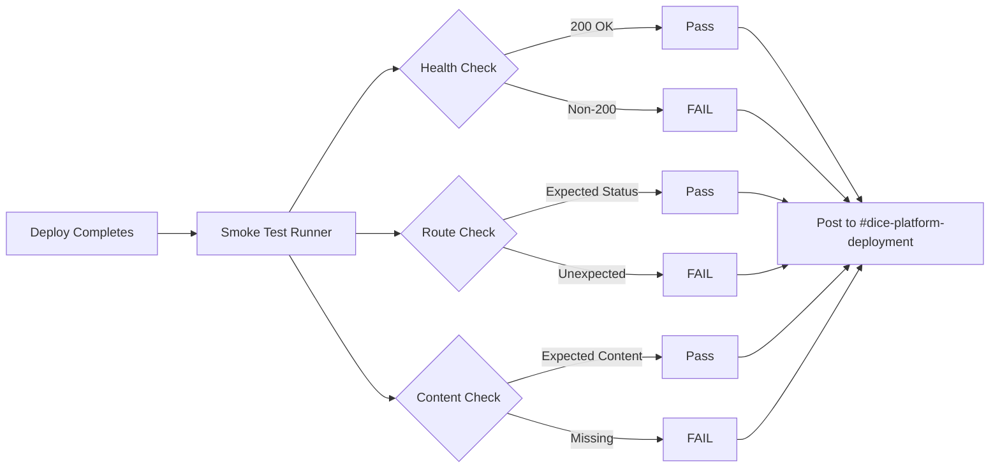
```mermaid
flowchart LR
    D[Deploy Completes] --> ST[Smoke Test Runner]
    ST --> H{Health Check}
    H -->|200 OK| P1[Pass]
    H -->|Non-200| F1[FAIL]
    ST --> R{Route Check}
    R -->|Expected Status| P2[Pass]
    R -->|Unexpected| F2[FAIL]
    ST --> C{Content Check}
    C -->|Expected Content| P3[Pass]
    C -->|Missing| F3[FAIL]
    P1 --> SL[Post to #dice-platform-deployment]
    P2 --> SL
    P3 --> SL
    F1 --> SL
    F2 --> SL
    F3 --> SL
```

### 14.2 `zice-core` Smoke Tests

Run against the deployed Railway URL (`$DEPLOY_URL`):

| # | Test | Method | Expected |
|---|---|---|---|
| 1 | Health check | `GET /api/v1/health` | `200 OK` with `{"status": "ok"}` |
| 2 | API versioning | `GET /api/v1/` | `200` or `404` (not `500`) |
| 3 | Tenant resolution | `GET /api/v1/tenants/resolve?domain=unknown.com` | `404` (not crash/5xx) |
| 4 | Auth required | `GET /api/v1/players` (no Bearer token) | `401 Unauthorized` |
| 5 | OpenAPI spec accessible | `GET /docs/openapi.yaml` or `/swagger/` | `200 OK` |
| 6 | CORS headers present | `OPTIONS /api/v1/health` with `Origin: https://zice.io` | `Access-Control-Allow-Origin` header present |

### 14.3 `zice-frontend` Smoke Tests

Run against the deployed Vercel URL (`$DEPLOY_URL`):

| # | Test | Method | Expected |
|---|---|---|---|
| 1 | Homepage loads | `GET /` | `200 OK`, body contains platform name |
| 2 | Login page loads | `GET /login` | `200 OK`, body contains "Sign in" or login form |
| 3 | Auth redirect | `GET /tools/roster-auditor` (no session) | `302` redirect to `/login` |
| 4 | Static assets load | `GET /_next/static/...` (any chunk) | `200 OK` |
| 5 | 404 handling | `GET /nonexistent-page` | `404` (not `500`) |
| 6 | Subdomain handling | `GET /` with `Host: test-org.zice.io` | Does not crash (returns `200` or redirect) |

### 14.4 Implementation

**Makefile target** in both repos:

```makefile
# make smoke DEPLOY_URL=https://zice-core.railway.app
smoke:
	@echo "Running smoke tests against $(DEPLOY_URL)..."
	./scripts/smoke-test.sh $(DEPLOY_URL)
```

**`scripts/smoke-test.sh`** — A simple bash script using `curl`:
- Runs each test sequentially
- Exits with non-zero code on any failure
- Outputs results in a summary table format
- Called by the GitHub Actions deploy workflow after successful deployment
- Results are posted to `#dice-platform-deployment` via the deploy notification workflow

**GitHub Actions integration:**

```yaml
# In deploy-notify.yml, after deploy step:
- name: Run smoke tests
  run: make smoke DEPLOY_URL=${{ steps.deploy.outputs.url }}
  continue-on-error: true

- name: Post smoke test results to Slack
  if: always()
  run: |
    # Posts pass/fail summary to #dice-platform-deployment
```

---

## 15. Backend Service Roadmap

The Go backend starts as a monolith (`zice-core`) but is architected with clear domain boundaries for future extraction into independent microservices.

### Current (Phase 1-2): Monolith

| Service | Repo | Description | Status |
|---|---|---|---|
| **Core Platform** | `zice-core` | Identity, multi-tenant management, organizations, players, guardians, memberships, rosters, RLS, tenant resolution API | Phase 1 (now) |

### Future Iterations: Service Extraction

| Service | Planned Repo | Description | Extraction Trigger |
|---|---|---|---|
| **Communications** | `zice-comms` | Threaded team messaging, coach announcements, SMS/email/push notification dispatch | Milestone 3 — when messaging volume justifies independent scaling |
| **Payments** | `zice-payments` | Stripe Connect integration, invoicing, payment splitting, financial reporting | Milestone 3+ — when payment processing needs isolation for PCI compliance |
| **Compliance** | `zice-compliance` | Automated compliance chasing (USA Hockey IDs, waivers, SafeSport), background job queues | Milestone 3 — when compliance automation requires async processing |
| **Marketplace** | `zice-marketplace` | Hyper-local gear exchange, inventory, on-rink handoff coordination | Milestone 3 — distinct bounded context with its own data model |

### Extraction Strategy

The `zice-core` internal package structure (`internal/domain/`, `internal/service/`, `internal/repository/`) maps 1:1 to future service boundaries. When a domain area is extracted:
1. The domain + service + repository packages move to the new repo.
2. The API handlers move with them.
3. Inter-service communication uses async events (NATS/Redis Streams) for loose coupling.
4. The shared `auth` middleware is published as a Go module for reuse.

---

## 16. Admin Import & Bulk Operations

Club admins are the **super users** of the platform. They are responsible for importing rosters, managing guardian lists, and onboarding players — parents and coaches do not perform these actions. This section defines the admin import capabilities, RLS policies, and API endpoints required.

### 16.1 Admin Role: Super User Capabilities

Admins have **full CRUD access** to all data within their organization:

| Capability | Description | RLS Policy |
|---|---|---|
| Import players | Bulk create players from CSV/manual entry | `admin_insert_players` |
| Import guardians | Bulk link guardians to players | `admin_insert_guardians` |
| Manage rosters | Add/remove/update players on team rosters | `org_staff_manage_rosters` (existing) |
| Manage memberships | Invite users, assign roles | `org_admin_manage` (existing) |
| Deactivate guardians | Soft-delete guardian links with audit trail | `admin_update_guardians` (existing) |
| Update org settings | Branding, contact info, custom domain | `org_admin_update` (existing) |
| Manage games/schedule | Create/update/cancel games | `games_insert_admin_coach` (existing) |
| View audit logs | Guardian deactivation/reactivation history | `org_admin_select_audit` (existing) |
| Bulk import via CSV | Upload roster CSV and create players + roster entries in one operation | New batch endpoint |

### 16.2 Admin Import Workflow

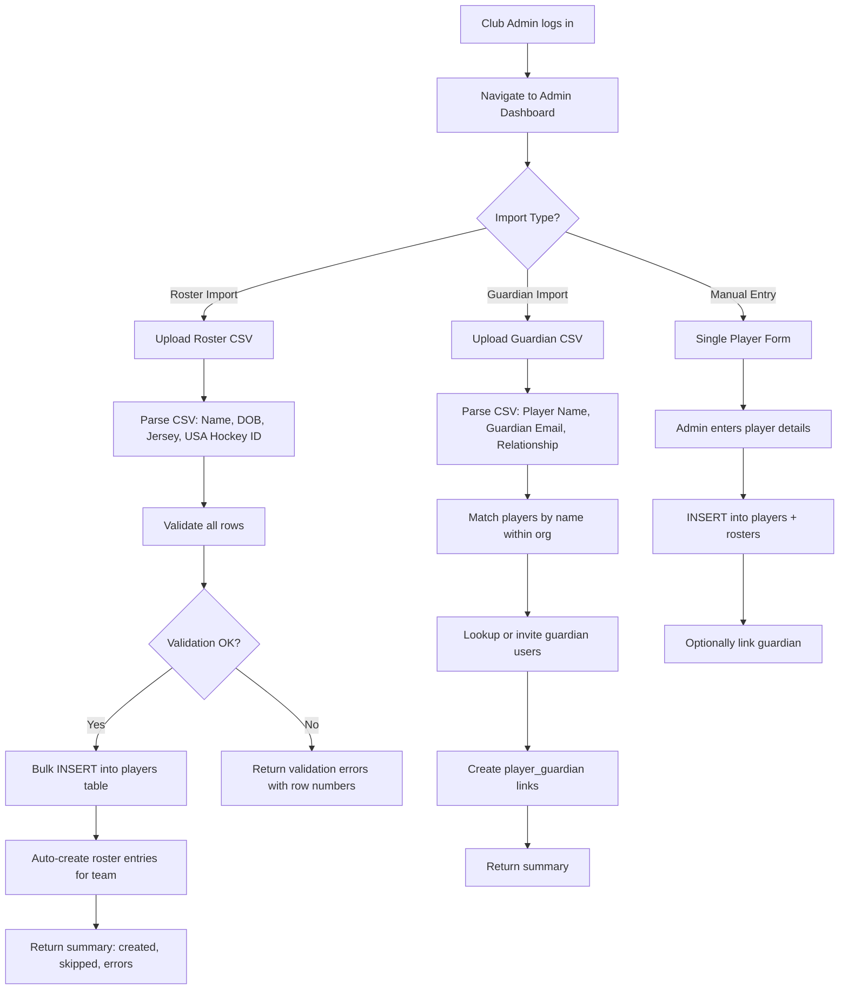
```mermaid
flowchart TD
    A[Club Admin logs in] --> B[Navigate to Admin Dashboard]
    B --> C{Import Type?}

    C -->|Roster Import| D[Upload Roster CSV]
    D --> D1[Parse CSV: Name, DOB, Jersey, USA Hockey ID]
    D1 --> D2[Validate all rows]
    D2 --> D3{Validation OK?}
    D3 -->|Yes| D4[Bulk INSERT into players table]
    D4 --> D5[Auto-create roster entries for team]
    D5 --> D6[Return summary: created, skipped, errors]
    D3 -->|No| D7[Return validation errors with row numbers]

    C -->|Guardian Import| E[Upload Guardian CSV]
    E --> E1[Parse CSV: Player Name, Guardian Email, Relationship]
    E1 --> E2[Match players by name within org]
    E2 --> E3[Lookup or invite guardian users]
    E3 --> E4[Create player_guardian links]
    E4 --> E5[Return summary]

    C -->|Manual Entry| F[Single Player Form]
    F --> F1[Admin enters player details]
    F1 --> F2[INSERT into players + rosters]
    F2 --> F3[Optionally link guardian]
```

### 16.3 New RLS Policies for Admin Import

The following policies must be added to grant admins INSERT access to `players` and `player_guardians`:

| Table | Operation | Policy Name | Filter |
|---|---|---|---|
| `players` | INSERT | `admin_insert_players` | `EXISTS (membership with role='admin' for auth.uid())` — Admin of any org can create players (player is org-independent; org link is via `rosters`) |
| `players` | UPDATE | `admin_update_players` | `EXISTS (roster in admin's org for this player)` — Admin can update players rostered in their org |
| `player_guardians` | INSERT | `admin_insert_guardians` | `EXISTS (roster in admin's org for this player_id)` — Admin can create guardian links for players rostered in their org |

**Policy SQL:**

```sql
-- Org admins can create players (players are org-independent;
-- the org relationship is established via the rosters table)
CREATE POLICY admin_insert_players ON public.players
  FOR INSERT
  WITH CHECK (
    EXISTS (
      SELECT 1 FROM public.memberships m
      WHERE m.user_id = auth.uid()
        AND m.role = 'admin'
    )
  );

-- Org admins can update players rostered in their org
CREATE POLICY admin_update_players ON public.players
  FOR UPDATE
  USING (
    EXISTS (
      SELECT 1 FROM public.rosters r
      JOIN public.memberships m ON m.org_id = r.org_id
      WHERE r.player_id = players.id
        AND m.user_id = auth.uid()
        AND m.role = 'admin'
    )
  )
  WITH CHECK (
    EXISTS (
      SELECT 1 FROM public.rosters r
      JOIN public.memberships m ON m.org_id = r.org_id
      WHERE r.player_id = players.id
        AND m.user_id = auth.uid()
        AND m.role = 'admin'
    )
  );

-- Org admins can create guardian links for players rostered in their org
CREATE POLICY admin_insert_guardians ON public.player_guardians
  FOR INSERT
  WITH CHECK (
    EXISTS (
      SELECT 1 FROM public.rosters r
      JOIN public.memberships m ON m.org_id = r.org_id
      WHERE r.player_id = player_guardians.player_id
        AND m.user_id = auth.uid()
        AND m.role = 'admin'
    )
  );
```

### 16.4 Admin Import API Endpoints

```
# Bulk Import (Admin only)
POST   /api/v1/orgs/:id/import/roster       # Bulk import players + roster entries from CSV
POST   /api/v1/orgs/:id/import/guardians     # Bulk import guardian links from CSV
GET    /api/v1/orgs/:id/import/history        # View past import jobs + results

# Single-record admin operations (supplement existing endpoints)
POST   /api/v1/orgs/:id/players              # Admin creates a player within org context
POST   /api/v1/orgs/:id/players/:pid/guardians  # Admin links guardian to org player
```

**Roster Import Request (`POST /api/v1/orgs/:id/import/roster`):**

```json
{
  "team_designation": "14U Gold",
  "season": "2025-26",
  "players": [
    {
      "first_name": "Liam",
      "last_name": "O'Brien",
      "dob": "2012-03-15",
      "usa_hockey_id": "USH20120315A1",
      "jersey_number": "11"
    }
  ]
}
```

**Roster Import Response:**

```json
{
  "data": {
    "total": 15,
    "created": 14,
    "skipped": 1,
    "errors": [
      {
        "row": 8,
        "field": "usa_hockey_id",
        "message": "Invalid format: must be 14 alphanumeric characters"
      }
    ]
  },
  "error": null,
  "meta": { "timestamp": "..." }
}
```

**Guardian Import Request (`POST /api/v1/orgs/:id/import/guardians`):**

```json
{
  "guardians": [
    {
      "player_first_name": "Liam",
      "player_last_name": "O'Brien",
      "guardian_email": "parent@example.com",
      "relationship": "parent",
      "is_primary": true,
      "permissions": ["financial", "medical", "legal_signer", "schedule_view", "pickup", "messaging"]
    }
  ]
}
```

### 16.5 Admin-Created vs. Parent-Created Players

Players created by admins via import differ from parent-created players:

| Aspect | Admin-Imported Player | Parent-Created Player |
|---|---|---|
| Created by | Club admin (via import or manual) | Parent (via onboarding) |
| Initial guardian | May have none (pending parent claim) | Creating parent is auto-linked as primary guardian |
| Roster status | Immediately `active` on specified team | `pending` until admin approves |
| Parent notification | Email sent to guardian if email provided | N/A (parent is the creator) |
| Claim flow | Parent signs up → matches player by name+DOB → claims guardianship | N/A |

**Player Claim Flow (admin-imported players):**

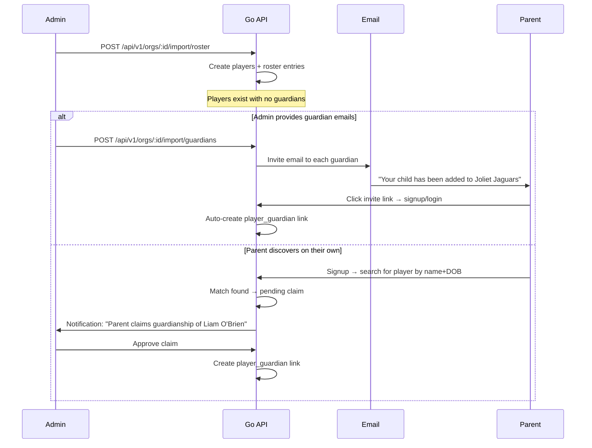
```mermaid
sequenceDiagram
    participant Admin
    participant API as Go API
    participant Email
    participant Parent

    Admin->>API: POST /api/v1/orgs/:id/import/roster
    API->>API: Create players + roster entries
    Note over API: Players exist with no guardians

    alt Admin provides guardian emails
        Admin->>API: POST /api/v1/orgs/:id/import/guardians
        API->>Email: Invite email to each guardian
        Email->>Parent: "Your child has been added to Joliet Jaguars"
        Parent->>API: Click invite link → signup/login
        API->>API: Auto-create player_guardian link
    else Parent discovers on their own
        Parent->>API: Signup → search for player by name+DOB
        API->>API: Match found → pending claim
        API->>Admin: Notification: "Parent claims guardianship of Liam O'Brien"
        Admin->>API: Approve claim
        API->>API: Create player_guardian link
    end
```

### 16.6 Admin Dashboard Capabilities (Summary)

The admin dashboard in `zice-frontend` should provide:

- **Roster Management**: View/edit team rosters, add/remove players, change jersey numbers
- **Import Center**: Upload CSV files for bulk roster and guardian imports
- **Guardian Management**: View all guardians for org players, deactivate/reactivate with audit trail
- **Member Management**: Invite users, assign roles (coach, parent, viewer)
- **Schedule Management**: Create/edit game schedules
- **Import History**: View past imports with success/error summaries
- **Audit Trail**: View guardian deactivation/reactivation history

---

## 17. Universal Soft-Delete Policy

**All deletes across the platform are soft deletes.** No row is ever permanently removed from the database. Every core table has a `deleted_at timestamptz` column (NULL = active, non-NULL = soft-deleted). This ensures auditability, data recovery, and legal compliance.

### 17.1 Affected Tables

| Table | Soft-Delete Column | Behavior |
|---|---|---|
| `organizations` | `deleted_at` | Org is hidden from all queries; memberships, rosters remain for audit |
| `players` | `deleted_at` | Player hidden from rosters/guardian views; data preserved for compliance |
| `memberships` | `deleted_at` | User removed from org; can be restored by admin |
| `rosters` | `deleted_at` | Player removed from team roster; historical record preserved |
| `player_guardians` | `is_active` (existing) + `deleted_at` | `is_active=false` = deactivated (reversible with audit); `deleted_at` = permanently archived |
| `games` | `deleted_at` | Game cancelled/removed from schedule; historical record preserved |

### 17.2 Migration: Add `deleted_at` Columns

```sql
-- Add deleted_at to all core tables that don't already have soft-delete
ALTER TABLE public.organizations ADD COLUMN deleted_at timestamptz;
ALTER TABLE public.players ADD COLUMN deleted_at timestamptz;
ALTER TABLE public.memberships ADD COLUMN deleted_at timestamptz;
ALTER TABLE public.rosters ADD COLUMN deleted_at timestamptz;
ALTER TABLE public.games ADD COLUMN deleted_at timestamptz;

-- Partial indexes for efficient queries (exclude soft-deleted rows)
CREATE INDEX idx_organizations_active ON public.organizations (id) WHERE deleted_at IS NULL;
CREATE INDEX idx_players_active ON public.players (id) WHERE deleted_at IS NULL;
CREATE INDEX idx_memberships_active ON public.memberships (user_id, org_id) WHERE deleted_at IS NULL;
CREATE INDEX idx_rosters_active ON public.rosters (org_id, team_designation, season) WHERE deleted_at IS NULL;
CREATE INDEX idx_games_active ON public.games (org_id) WHERE deleted_at IS NULL;
```

### 17.3 RLS Policy Updates

All existing SELECT policies must be updated to include `AND deleted_at IS NULL` to exclude soft-deleted rows from normal queries. Admin users can query soft-deleted records via a separate endpoint for recovery/audit.

```sql
-- Example: update org_member_select to exclude soft-deleted orgs
-- Before: EXISTS (membership for auth.uid() + org.id)
-- After:  EXISTS (membership for auth.uid() + org.id) AND organizations.deleted_at IS NULL
```

### 17.4 API Behavior

- **DELETE endpoints** set `deleted_at = now()` instead of issuing SQL `DELETE`.
- **GET endpoints** filter `WHERE deleted_at IS NULL` by default.
- **Admin restore endpoint**: `PUT /api/v1/admin/{table}/{id}/restore` sets `deleted_at = NULL`.
- **Admin archive view**: `GET /api/v1/admin/{table}?include_deleted=true` returns all records including soft-deleted.
- **Cascading soft-delete**: When an org is soft-deleted, all memberships and rosters under it are also soft-deleted (app-layer logic, not DB cascade).

### 17.5 `player_guardians` Dual Soft-Delete

The `player_guardians` table has two levels of soft-delete:
1. **`is_active = false`** — Guardian link deactivated (reversible, logged in `guardian_audit_log`). Used for custody changes, temporary removal.
2. **`deleted_at IS NOT NULL`** — Guardian link permanently archived. Used when cleaning up old data.

Both conditions exclude the row from active queries.

---

## 18. Password Security & Passkey Authentication

### 18.1 Strong Password Enforcement

Supabase Auth provides built-in password strength configuration. Our policy:

| Setting | Value | Description |
|---|---|---|
| Minimum length | 10 characters | Longer than the 8-char minimum recommendation |
| Required characters | Digits + lowercase + uppercase + symbols | Strongest option available |
| Leaked password protection | Enabled | Rejects passwords found in HaveIBeenPwned database (Supabase Pro feature) |

**Backend enforcement (Go API):**

The `POST /api/v1/auth/signup` handler validates password strength *before* proxying to Supabase:

```go
type PasswordPolicy struct {
    MinLength        int  // 10
    RequireUppercase bool // true
    RequireLowercase bool // true
    RequireDigit     bool // true
    RequireSymbol    bool // true
}

func ValidatePassword(password string, policy PasswordPolicy) []string {
    // Returns array of violation messages (empty = valid)
}
```

**Frontend enforcement (Next.js):**

- Real-time password strength meter on signup form (visual bar: weak → fair → strong → very strong)
- Inline validation messages as user types
- Disable submit button until password meets all requirements
- Show requirements checklist: ✓ 10+ characters, ✓ uppercase, ✓ lowercase, ✓ digit, ✓ symbol

**Supabase Dashboard configuration:**

```
Auth > Settings > Password Security:
  - Minimum password length: 10
  - Required characters: Letters, digits, and symbols
  - Prevent use of leaked passwords: ON
```

### 18.2 Passkey (WebAuthn) Authentication

Passkeys provide passwordless, phishing-resistant authentication using biometrics or hardware security keys. Supabase Auth now supports passkeys natively via the `supabase-js` client SDK.

#### Supported Flows

| Flow | Description | API |
|---|---|---|
| Register passkey | User adds a passkey to their existing account | `auth.registerPasskey()` |
| Sign in with passkey | User authenticates using a registered passkey | `auth.signInWithPasskey()` |
| List passkeys | User views their registered passkeys | `auth.passkey.list()` |
| Update passkey | User renames a passkey (e.g., "MacBook Pro Touch ID") | `auth.passkey.update()` |
| Delete passkey | User removes a passkey | `auth.passkey.delete()` |

#### Frontend Implementation

```typescript
// Enable passkey support in Supabase client
const supabase = createClient(supabaseUrl, supabaseKey, {
  auth: {
    experimental: { passkey: true },
  },
});

// Register a passkey (from account settings)
const { data, error } = await supabase.auth.registerPasskey();

// Sign in with passkey (from login page)
const { data, error } = await supabase.auth.signInWithPasskey();
```

#### UI Components

| Component | Location | Description |
|---|---|---|
| `PasskeyLoginButton` | `/login` | "Sign in with Passkey" button on login form |
| `PasskeyRegister` | `/settings/security` | Register new passkey with device biometrics |
| `PasskeyList` | `/settings/security` | List registered passkeys with rename/delete |
| `PasswordStrengthMeter` | `/signup`, `/settings/security` | Visual strength indicator with requirements checklist |

#### Security Settings Page (`/settings/security`)

```
app/(protected)/settings/
└── security/
    └── page.tsx        # Password change + passkey management
```

Features:
- **Change password**: Current password + new password with strength meter
- **Passkey management**: Register, rename, delete passkeys
- **Active sessions**: View and revoke active sessions (future)

#### Go API Endpoints

Passkey ceremonies are handled entirely by the Supabase JS client SDK talking directly to Supabase Auth. The Go API does not need passkey-specific endpoints. However, the Go API must:

1. Accept JWTs issued via passkey authentication (no change needed — JWT validation is method-agnostic)
2. Expose a `GET /api/v1/auth/me` response that includes whether the user has passkeys registered (via Supabase admin API)

### 18.3 Auth Method Summary

| Method | Phase | Primary Use Case |
|---|---|---|
| Email + Password (strong) | Phase 1.5 | Standard signup, required for all new accounts |
| Magic Link | Phase 1.5 | Passwordless convenience, invite acceptance |
| Google OAuth | Phase 1.5 | Social login for convenience |
| Passkey (WebAuthn) | Phase 1.5+ | Phishing-resistant login, biometric convenience |
| Apple OAuth | Future | Required for iOS app |

---

## 19. Admin Dashboard — Full CRUD

Admins are super users within their organization. The admin dashboard provides full CRUD (Create, Read, Update, Soft-Delete) for all entity types. **All deletes are soft deletes** (see Section 17).

### 19.1 Admin Dashboard Layout

```
app/(protected)/admin/
├── layout.tsx                    # Admin sidebar + nav (role-gated)
├── page.tsx                      # Admin overview / stats
├── players/
│   ├── page.tsx                  # Player list (table with search, filter, pagination)
│   ├── [id]/page.tsx             # Player detail (edit form + guardian links + roster history)
│   └── new/page.tsx              # Create player form
├── guardians/
│   ├── page.tsx                  # Guardian list (all guardians across org players)
│   └── [id]/page.tsx             # Guardian detail (permissions, linked players, audit log)
├── staff/
│   ├── page.tsx                  # Staff/member list (admins, coaches, parents, viewers)
│   ├── [id]/page.tsx             # Member detail (role, joined date, edit role)
│   └── invite/page.tsx           # Invite new member form
├── rosters/
│   ├── page.tsx                  # Roster list by team + season
│   └── [id]/page.tsx             # Roster detail (player list, add/remove)
├── schedule/
│   ├── page.tsx                  # Game schedule (calendar + list view)
│   └── [id]/page.tsx             # Game detail (edit scores, status)
├── imports/
│   ├── page.tsx                  # Import center (upload CSV, view history)
│   └── [id]/page.tsx             # Import job detail (results, errors)
└── audit/
    └── page.tsx                  # Full audit log viewer
```

### 19.2 CRUD Operations by Entity

#### Players

| Operation | Endpoint | Admin Action | Notes |
|---|---|---|---|
| List | `GET /api/v1/players?org_id=...` | View all players rostered in org | Filterable by team, season, status |
| Create | `POST /api/v1/orgs/:id/players` | Add single player + roster entry | Validates USA Hockey ID format |
| Read | `GET /api/v1/players/:id` | View player detail | Includes guardian links, roster history |
| Update | `PUT /api/v1/players/:id` | Edit name, DOB, USA Hockey ID | Audit logged |
| Soft-Delete | `DELETE /api/v1/players/:id` | Set `deleted_at = now()` | Player hidden from all views; data preserved |
| Restore | `PUT /api/v1/admin/players/:id/restore` | Set `deleted_at = NULL` | Admin-only recovery |

#### Guardians (Player Guardian Links)

| Operation | Endpoint | Admin Action | Notes |
|---|---|---|---|
| List | `GET /api/v1/players/:id/guardians` | View guardians for a player | Includes permissions, relationship type |
| Create | `POST /api/v1/orgs/:id/players/:pid/guardians` | Link guardian to player | Sets relationship + permissions |
| Read | `GET /api/v1/guardians/:id` | View guardian link detail | Includes audit history |
| Update | `PUT /api/v1/guardians/:id` | Change permissions, relationship | Audit logged with previous state |
| Deactivate | `PUT /api/v1/guardians/:id/deactivate` | Set `is_active = false` | Requires reason; logged in `guardian_audit_log` |
| Reactivate | `PUT /api/v1/guardians/:id/reactivate` | Set `is_active = true` | Requires reason; logged in `guardian_audit_log` |
| Soft-Delete | `DELETE /api/v1/guardians/:id` | Set `deleted_at = now()` | Permanent archive; not reversible via reactivate |

#### Staff / Members

| Operation | Endpoint | Admin Action | Notes |
|---|---|---|---|
| List | `GET /api/v1/memberships?org_id=...` | View all org members | Filterable by role |
| Invite | `POST /api/v1/invites` | Send invite email | Creates pending membership |
| Read | `GET /api/v1/memberships/:id` | View member detail | Role, joined date, status |
| Update | `PUT /api/v1/memberships/:id` | Change role | e.g., promote parent → coach |
| Soft-Delete | `DELETE /api/v1/memberships/:id` | Set `deleted_at = now()` | User removed from org; can be restored |
| Restore | `PUT /api/v1/admin/memberships/:id/restore` | Set `deleted_at = NULL` | Re-add user to org |

#### Rosters

| Operation | Endpoint | Admin Action | Notes |
|---|---|---|---|
| List | `GET /api/v1/rosters?org_id=...` | View rosters by team + season | Grouped by team_designation |
| Create | `POST /api/v1/rosters` | Add player to roster | Validates player exists |
| Read | `GET /api/v1/rosters/:id` | View roster entry detail | Player info, jersey, status |
| Update | `PUT /api/v1/rosters/:id` | Change jersey number, status | Audit logged |
| Soft-Delete | `DELETE /api/v1/rosters/:id` | Set `deleted_at = now()` | Player removed from team; historical record preserved |

#### Games / Schedule

| Operation | Endpoint | Admin Action | Notes |
|---|---|---|---|
| List | `GET /api/v1/games?org_id=...` | View game schedule | Filterable by team, date range, status |
| Create | `POST /api/v1/games` | Add game to schedule | Date, opponent, location, type |
| Read | `GET /api/v1/games/:id` | View game detail | Score, status, notes |
| Update | `PUT /api/v1/games/:id` | Edit score, status, reschedule | Status transitions: scheduled → completed/cancelled |
| Soft-Delete | `DELETE /api/v1/games/:id` | Set `deleted_at = now()` | Game removed from schedule; data preserved |

### 19.3 Admin UI Shared Components

| Component | Description |
|---|---|
| `AdminLayout` | Sidebar navigation with role gating (redirects non-admins) |
| `DataTable` | Reusable sortable, filterable, paginated table with search |
| `EntityForm` | Reusable form component for create/edit with validation |
| `SoftDeleteButton` | Confirmation dialog → calls DELETE endpoint → shows "Deleted" toast |
| `RestoreButton` | Admin-only button to restore soft-deleted records |
| `AuditTrail` | Timeline component showing change history for an entity |
| `BulkActionBar` | Multi-select toolbar for bulk soft-delete, bulk status change |

### 19.4 Admin Role Gating

The admin dashboard is gated at two levels:
1. **Frontend middleware**: `middleware.ts` checks membership role for `/admin/*` routes. Non-admins get redirected to `/dashboard`.
2. **Backend RLS**: All admin operations are enforced by RLS policies (`is_org_admin(auth.uid(), org_id)`). Even if a non-admin crafts a direct API request, RLS blocks it.

---

## 20. User Audit Log

A comprehensive audit log captures all API requests and data mutations for security, compliance, and debugging.

### 20.1 Audit Log Table

#### `public.audit_log`

| Column | Type | Constraints | Description |
|---|---|---|---|
| `id` | `uuid` | PK, default `gen_random_uuid()` | |
| `user_id` | `uuid` | FK -> `auth.users(id)`, NULLABLE | Authenticated user (NULL for anonymous/system actions) |
| `org_id` | `uuid` | FK -> `organizations(id)`, NULLABLE | Tenant context (from X-Org-ID header) |
| `action` | `text` | NOT NULL | Action type: `create`, `read`, `update`, `delete`, `login`, `logout`, `signup`, `password_change`, `passkey_register`, `import`, `restore` |
| `resource_type` | `text` | NOT NULL | Entity type: `player`, `guardian`, `membership`, `roster`, `game`, `organization`, `user`, `import_job` |
| `resource_id` | `uuid` | NULLABLE | ID of the affected resource |
| `method` | `text` | NOT NULL | HTTP method: `GET`, `POST`, `PUT`, `DELETE` |
| `path` | `text` | NOT NULL | Request path (e.g., `/api/v1/players/abc-123`) |
| `old_data` | `jsonb` | NULLABLE | Previous state of the resource (for updates/deletes). **Excluded for `password_change` events.** |
| `new_data` | `jsonb` | NULLABLE | New state of the resource (for creates/updates). **Excluded for `password_change` events.** |
| `metadata` | `jsonb` | DEFAULT `'{}'` | Additional context: IP address, user agent, request ID |
| `status_code` | `integer` | NOT NULL | HTTP response status code |
| `created_at` | `timestamptz` | DEFAULT `now()` | |

### 20.2 Audit Log Rules

| Rule | Description |
|---|---|
| **Log all mutations** | Every `POST`, `PUT`, `DELETE` request is logged with old/new data |
| **Log auth events** | Login, logout, signup, password change, passkey registration |
| **Redact passwords** | `password_change` events log `action=password_change` only — no `old_data` or `new_data` containing passwords |
| **Redact sensitive fields** | Before storing `old_data`/`new_data`, strip: `password`, `password_hash`, `refresh_token`, `access_token` |
| **Include request context** | IP address, user agent, and request ID in `metadata` |
| **Append-only** | No UPDATE or DELETE allowed on `audit_log` — INSERT only |
| **RLS** | Org admins can SELECT their own org's audit logs; super-admins can see all |

### 20.3 Migration

```sql
CREATE TABLE public.audit_log (
  id             uuid        PRIMARY KEY DEFAULT gen_random_uuid(),
  user_id        uuid        REFERENCES auth.users(id),
  org_id         uuid        REFERENCES public.organizations(id),
  action         text        NOT NULL CHECK (action IN (
                   'create', 'read', 'update', 'delete',
                   'login', 'logout', 'signup',
                   'password_change', 'passkey_register',
                   'import', 'restore'
                 )),
  resource_type  text        NOT NULL,
  resource_id    uuid,
  method         text        NOT NULL,
  path           text        NOT NULL,
  old_data       jsonb,
  new_data       jsonb,
  metadata       jsonb       NOT NULL DEFAULT '{}',
  status_code    integer     NOT NULL,
  created_at     timestamptz NOT NULL DEFAULT now()
);

-- Append-only: no UPDATE or DELETE
ALTER TABLE public.audit_log ENABLE ROW LEVEL SECURITY;

CREATE POLICY audit_log_insert ON public.audit_log
  FOR INSERT WITH CHECK (true);  -- All authenticated requests can insert

CREATE POLICY audit_log_admin_select ON public.audit_log
  FOR SELECT USING (
    public.is_org_admin(auth.uid(), org_id)
    OR org_id IS NULL  -- system-level events visible to the acting user
  );

-- Indexes for common queries
CREATE INDEX idx_audit_log_user_id ON public.audit_log (user_id);
CREATE INDEX idx_audit_log_org_id ON public.audit_log (org_id) WHERE org_id IS NOT NULL;
CREATE INDEX idx_audit_log_resource ON public.audit_log (resource_type, resource_id);
CREATE INDEX idx_audit_log_created_at ON public.audit_log (created_at DESC);
CREATE INDEX idx_audit_log_action ON public.audit_log (action);
```

### 20.4 Go Middleware Implementation

The audit log is captured via a Go HTTP middleware that wraps all API handlers:

```go
// middleware/audit.go
func AuditLog() func(http.Handler) http.Handler {
    return func(next http.Handler) http.Handler {
        return http.HandlerFunc(func(w http.ResponseWriter, r *http.Request) {
            // 1. Capture request context (user_id, org_id, method, path, IP, UA)
            // 2. For mutations (POST/PUT/DELETE): read old_data before handler runs
            // 3. Call next handler with response recorder
            // 4. After handler: capture new_data from response body
            // 5. Redact sensitive fields (passwords, tokens)
            // 6. INSERT into audit_log asynchronously (goroutine + channel)
        })
    }
}

// Sensitive field redaction
var redactedFields = map[string]bool{
    "password": true, "password_hash": true,
    "refresh_token": true, "access_token": true,
    "current_password": true, "new_password": true,
}

func redactSensitiveFields(data map[string]interface{}) map[string]interface{} {
    for key := range data {
        if redactedFields[key] {
            data[key] = "[REDACTED]"
        }
    }
    return data
}
```

### 20.5 Password Change Audit

Password change events are treated specially:

```go
// For action="password_change":
auditEntry := AuditEntry{
    Action:       "password_change",
    ResourceType: "user",
    ResourceID:   userID,
    OldData:      nil,  // NEVER log old password
    NewData:      nil,  // NEVER log new password
    Metadata: map[string]interface{}{
        "ip":         r.RemoteAddr,
        "user_agent": r.UserAgent(),
        "request_id": middleware.RequestIDFromContext(r.Context()),
        "note":       "Password changed by user",
    },
}
```

### 20.6 Audit Log API Endpoints

```
GET    /api/v1/admin/audit                   # List audit log entries (admin, filterable)
GET    /api/v1/admin/audit/:id               # Get single audit entry detail
```

**Query Parameters for `GET /api/v1/admin/audit`:**

| Param | Type | Description |
|---|---|---|
| `user_id` | `uuid` | Filter by acting user |
| `resource_type` | `string` | Filter by entity type (`player`, `guardian`, etc.) |
| `resource_id` | `uuid` | Filter by specific resource |
| `action` | `string` | Filter by action type (`create`, `update`, `delete`, etc.) |
| `from` | `datetime` | Start of date range |
| `to` | `datetime` | End of date range |
| `page` | `int` | Pagination (default: 1) |
| `per_page` | `int` | Items per page (default: 50, max: 200) |

### 20.7 Audit Log UI

The admin dashboard includes an audit log viewer at `/admin/audit`:

| Feature | Description |
|---|---|
| Timeline view | Chronological list of events with user avatars |
| Diff view | Side-by-side old/new data comparison for updates |
| Filters | By user, entity type, action, date range |
| Search | Full-text search on path and metadata |
| Export | CSV download of filtered audit entries |

---

## 21. Team Blog & Content Publishing

Coaches, admins, and designated staff can publish articles, announcements, and messages visible to their team/org. The blog is org-scoped (multi-tenant isolated) and serves as the primary communication channel between coaching staff and families.

### 21.1 Database Schema

```sql
-- Blog posts (org-scoped)
CREATE TABLE blog_posts (
  id UUID PRIMARY KEY DEFAULT gen_random_uuid(),
  org_id UUID NOT NULL REFERENCES organizations(id),
  author_id UUID NOT NULL REFERENCES auth.users(id),
  title TEXT NOT NULL CHECK (char_length(title) BETWEEN 1 AND 200),
  slug TEXT NOT NULL,
  body TEXT NOT NULL,
  excerpt TEXT,                              -- auto-generated or manual summary
  status TEXT NOT NULL DEFAULT 'draft' CHECK (status IN ('draft', 'published', 'archived')),
  pinned BOOLEAN NOT NULL DEFAULT false,
  published_at TIMESTAMPTZ,                  -- NULL until first publish
  category TEXT,                             -- optional categorization
  tags TEXT[] DEFAULT '{}',                  -- flexible tagging
  cover_image_url TEXT,                      -- optional hero image
  allow_comments BOOLEAN NOT NULL DEFAULT true,
  created_at TIMESTAMPTZ NOT NULL DEFAULT now(),
  updated_at TIMESTAMPTZ NOT NULL DEFAULT now(),
  deleted_at TIMESTAMPTZ,                    -- soft delete
  UNIQUE (org_id, slug)
);

-- Blog comments (threaded)
CREATE TABLE blog_comments (
  id UUID PRIMARY KEY DEFAULT gen_random_uuid(),
  post_id UUID NOT NULL REFERENCES blog_posts(id),
  author_id UUID NOT NULL REFERENCES auth.users(id),
  parent_comment_id UUID REFERENCES blog_comments(id), -- threading
  body TEXT NOT NULL CHECK (char_length(body) BETWEEN 1 AND 5000),
  created_at TIMESTAMPTZ NOT NULL DEFAULT now(),
  updated_at TIMESTAMPTZ NOT NULL DEFAULT now(),
  deleted_at TIMESTAMPTZ                     -- soft delete
);

-- Blog media attachments
CREATE TABLE blog_media (
  id UUID PRIMARY KEY DEFAULT gen_random_uuid(),
  post_id UUID NOT NULL REFERENCES blog_posts(id),
  uploader_id UUID NOT NULL REFERENCES auth.users(id),
  file_url TEXT NOT NULL,
  file_type TEXT NOT NULL,                   -- 'image', 'video', 'document'
  file_name TEXT NOT NULL,
  file_size_bytes BIGINT,
  sort_order INT NOT NULL DEFAULT 0,
  created_at TIMESTAMPTZ NOT NULL DEFAULT now()
);

-- Indexes
CREATE INDEX idx_blog_posts_org_status ON blog_posts(org_id, status) WHERE deleted_at IS NULL;
CREATE INDEX idx_blog_posts_org_published ON blog_posts(org_id, published_at DESC) WHERE status = 'published' AND deleted_at IS NULL;
CREATE INDEX idx_blog_posts_pinned ON blog_posts(org_id, pinned) WHERE pinned = true AND deleted_at IS NULL;
CREATE INDEX idx_blog_comments_post ON blog_comments(post_id) WHERE deleted_at IS NULL;
CREATE INDEX idx_blog_media_post ON blog_media(post_id);
```

### 21.2 RLS Policies

```sql
-- blog_posts: org members can read published posts
CREATE POLICY blog_posts_read ON blog_posts FOR SELECT
  USING (
    org_id IN (SELECT org_id FROM memberships WHERE user_id = auth.uid() AND deleted_at IS NULL)
    AND (status = 'published' OR author_id = auth.uid() OR
         EXISTS (SELECT 1 FROM memberships WHERE user_id = auth.uid() AND org_id = blog_posts.org_id AND role = 'admin' AND deleted_at IS NULL))
    AND deleted_at IS NULL
  );

-- blog_posts: coaches + admins can create
CREATE POLICY blog_posts_insert ON blog_posts FOR INSERT
  WITH CHECK (
    org_id IN (SELECT org_id FROM memberships WHERE user_id = auth.uid() AND role IN ('admin', 'coach') AND deleted_at IS NULL)
    AND author_id = auth.uid()
  );

-- blog_posts: author or admin can update
CREATE POLICY blog_posts_update ON blog_posts FOR UPDATE
  USING (
    (author_id = auth.uid() OR
     EXISTS (SELECT 1 FROM memberships WHERE user_id = auth.uid() AND org_id = blog_posts.org_id AND role = 'admin' AND deleted_at IS NULL))
  );

-- blog_comments: org members can read
CREATE POLICY blog_comments_read ON blog_comments FOR SELECT
  USING (
    post_id IN (SELECT id FROM blog_posts WHERE org_id IN (
      SELECT org_id FROM memberships WHERE user_id = auth.uid() AND deleted_at IS NULL
    ) AND deleted_at IS NULL)
    AND deleted_at IS NULL
  );

-- blog_comments: any authenticated org member can comment
CREATE POLICY blog_comments_insert ON blog_comments FOR INSERT
  WITH CHECK (
    author_id = auth.uid()
    AND post_id IN (SELECT id FROM blog_posts WHERE allow_comments = true AND status = 'published' AND deleted_at IS NULL
      AND org_id IN (SELECT org_id FROM memberships WHERE user_id = auth.uid() AND deleted_at IS NULL))
  );

-- blog_comments: author or admin can update/soft-delete own comments
CREATE POLICY blog_comments_update ON blog_comments FOR UPDATE
  USING (
    author_id = auth.uid() OR
    EXISTS (SELECT 1 FROM memberships m JOIN blog_posts p ON p.org_id = m.org_id
      WHERE p.id = blog_comments.post_id AND m.user_id = auth.uid() AND m.role = 'admin' AND m.deleted_at IS NULL)
  );
```

### 21.3 Role-Based Access Matrix

| Action | Admin | Coach | Parent | Player (18+) |
|---|---|---|---|---|
| Create post | ✓ | ✓ | ✗ | ✗ |
| Edit own post | ✓ | ✓ | ✗ | ✗ |
| Edit any post | ✓ | ✗ | ✗ | ✗ |
| Delete any post | ✓ | ✗ | ✗ | ✗ |
| Pin/unpin post | ✓ | ✗ | ✗ | ✗ |
| Read published posts | ✓ | ✓ | ✓ | ✓ |
| Read draft posts | ✓ (all) | Own only | ✗ | ✗ |
| Comment on posts | ✓ | ✓ | ✓ | ✓ |
| Delete any comment | ✓ | ✗ | ✗ | ✗ |
| Upload media | ✓ | ✓ | ✗ | ✗ |
| Moderate comments | ✓ | ✗ | ✗ | ✗ |

### 21.4 API Endpoints

```
# Blog Posts
GET    /api/v1/orgs/:org_id/blog/posts           # List published posts (paginated, filterable by category/tag)
GET    /api/v1/orgs/:org_id/blog/posts/:slug      # Get single post by slug
POST   /api/v1/orgs/:org_id/blog/posts            # Create post (coach/admin)
PUT    /api/v1/orgs/:org_id/blog/posts/:id         # Update post (author/admin)
DELETE /api/v1/orgs/:org_id/blog/posts/:id         # Soft-delete post (author/admin)
PUT    /api/v1/orgs/:org_id/blog/posts/:id/publish  # Publish draft
PUT    /api/v1/orgs/:org_id/blog/posts/:id/pin      # Pin/unpin post (admin)
PUT    /api/v1/admin/blog/posts/:id/restore         # Restore soft-deleted post (admin)

# Blog Comments
GET    /api/v1/blog/posts/:post_id/comments        # List comments (threaded)
POST   /api/v1/blog/posts/:post_id/comments        # Add comment (any org member)
PUT    /api/v1/blog/comments/:id                    # Edit comment (author/admin)
DELETE /api/v1/blog/comments/:id                    # Soft-delete comment (author/admin)

# Blog Media
POST   /api/v1/blog/posts/:post_id/media           # Upload attachment (coach/admin)
DELETE /api/v1/blog/media/:id                       # Remove attachment
```

### 21.5 Content Features

- **Rich text body**: Markdown with sanitized HTML output. Support for headings, bold/italic, links, images, code blocks, and embedded video (YouTube/Vimeo URL auto-embed)
- **Draft → Publish workflow**: Posts start as `draft`. Author clicks "Publish" to set `status='published'` and `published_at=now()`. Can revert to draft.
- **Pinned posts**: Admins can pin up to 3 posts per org. Pinned posts appear first in the feed regardless of date.
- **Categories & tags**: Optional categorization (e.g., "Practice Updates", "Game Recaps", "Announcements"). Free-form tags for flexible filtering.
- **Threaded comments**: One level of nesting (reply-to). Admins can moderate (soft-delete) any comment.
- **Media attachments**: Images (JPEG, PNG, WebP), documents (PDF), video (MP4 or link embed). Stored in Supabase Storage, org-bucketed.
- **Excerpt auto-generation**: If `excerpt` is not provided, auto-truncate `body` to first 200 characters.
- **Audit integration**: All blog CRUD operations logged to `audit_log` table with action type `blog_create`, `blog_update`, `blog_delete`, `blog_publish`, `comment_create`, `comment_delete`.

### 21.6 Frontend Pages

| Route | Component | Description |
|---|---|---|
| `/blog` | `BlogFeed` | Paginated list of published posts (pinned first), category/tag filters, search |
| `/blog/:slug` | `BlogPost` | Full post view with comments section, media gallery |
| `/blog/new` | `BlogEditor` | Rich text editor for creating posts (coach/admin only) |
| `/blog/:slug/edit` | `BlogEditor` | Edit existing post (author/admin only) |
| `/admin/blog` | `AdminBlogList` | Admin view of all posts (including drafts/archived), bulk actions |

---

## 22. Platform Administration & Feature Gating

The platform has two distinct admin tiers: **Platform Admins** (Zice staff who manage the entire SaaS) and **Org/Team Admins** (club administrators who manage their own organization). Org admins are super-users within their tenant but are gated by platform-level feature flags that only platform admins can enable.

### 22.1 Admin Tier Model

```
┌─────────────────────────────────────────────────────────────┐
│                    PLATFORM ADMIN                           │
│  (Zice staff — global super-user)                           │
│                                                             │
│  Can: provision orgs, enable/disable features per org,      │
│       manage platform-wide settings, impersonate users,     │
│       view all orgs, access support tools                   │
├─────────────────────────────────────────────────────────────┤
│               ORG / TEAM ADMIN                              │
│  (Club administrator — scoped to their org)                 │
│                                                             │
│  Can: full CRUD on players, guardians, rosters, staff,      │
│       blog, events — BUT only features the platform         │
│       admin has enabled for their org                       │
├─────────────────────────────────────────────────────────────┤
│            COACH / PARENT / PLAYER                          │
│  (Regular users — scoped by role + RLS)                     │
└─────────────────────────────────────────────────────────────┘
```

### 22.2 Platform Admin Identity

Platform admins are stored in a dedicated table (not in `memberships`, since they are not scoped to any single org):

```sql
CREATE TABLE platform_admins (
  id UUID PRIMARY KEY DEFAULT gen_random_uuid(),
  user_id UUID NOT NULL REFERENCES auth.users(id) UNIQUE,
  name TEXT NOT NULL,
  email TEXT NOT NULL,
  role TEXT NOT NULL DEFAULT 'support' CHECK (role IN ('super_admin', 'support', 'billing')),
  permissions TEXT[] NOT NULL DEFAULT '{}',
  created_at TIMESTAMPTZ NOT NULL DEFAULT now(),
  updated_at TIMESTAMPTZ NOT NULL DEFAULT now(),
  deleted_at TIMESTAMPTZ
);

CREATE INDEX idx_platform_admins_user ON platform_admins(user_id) WHERE deleted_at IS NULL;
```

**Platform Admin Roles:**

| Role | Description | Capabilities |
|---|---|---|
| `super_admin` | Full platform control | Everything — org provisioning, feature flags, billing, impersonation, platform config |
| `support` | Customer support | Read-only access to all orgs, impersonate users for debugging, manage support tickets |
| `billing` | Financial operations | Manage Stripe Connect accounts, view payment reports across orgs, process platform-level refunds |

### 22.3 Organization Feature Flags

Each organization has a set of features that are enabled/disabled by platform admins. Org admins cannot use features that haven't been enabled for their org.

```sql
CREATE TABLE org_feature_flags (
  id UUID PRIMARY KEY DEFAULT gen_random_uuid(),
  org_id UUID NOT NULL REFERENCES organizations(id),
  feature TEXT NOT NULL,
  enabled BOOLEAN NOT NULL DEFAULT false,
  -- Configuration for the feature (limits, settings, etc.)
  config JSONB NOT NULL DEFAULT '{}',
  -- Who enabled it and when
  enabled_by UUID REFERENCES platform_admins(id),
  enabled_at TIMESTAMPTZ,
  disabled_by UUID REFERENCES platform_admins(id),
  disabled_at TIMESTAMPTZ,
  created_at TIMESTAMPTZ NOT NULL DEFAULT now(),
  updated_at TIMESTAMPTZ NOT NULL DEFAULT now(),
  UNIQUE (org_id, feature)
);

CREATE INDEX idx_org_feature_flags_org ON org_feature_flags(org_id);
```

**Feature Flag Registry:**

| Feature Key | Description | Default | Config Options |
|---|---|---|---|
| `payments` | Accept payments via Stripe | `false` | `{"stripe_connect_id": "...", "payout_schedule": "daily"}` |
| `credit_card_surcharges` | Allow org to pass CC surcharges to payers | `false` | `{"max_surcharge_percent": 3.5}` |
| `installment_plans` | Allow orgs to offer installment billing | `false` | `{"max_installments": 12}` |
| `sibling_discounts` | Allow family/sibling discount configuration | `true` | `{}` |
| `blog` | Team blog / content publishing | `true` | `{"max_media_size_mb": 50}` |
| `bulk_import` | CSV bulk import for rosters/guardians | `true` | `{"max_rows_per_import": 500}` |
| `custom_domain` | BYOD custom domain support | `false` | `{"domain": "...", "ssl_provisioned": false}` |
| `waitlists` | Waitlist support for capacity-limited events | `true` | `{}` |
| `invoicing` | PDF invoice generation + download | `false` | `{}` |
| `api_access` | Third-party API access for the org | `false` | `{"rate_limit_rpm": 60}` |

> **Design principle**: Features default to `false` for paid/complex capabilities (payments, surcharges, custom domains) and `true` for core features (blog, import, discounts). Platform admins explicitly enable paid features during org onboarding.

### 22.4 Gating Enforcement

Feature gating is enforced at **two layers**:

**1. API Layer (Go middleware)**

```go
// internal/middleware/feature_gate.go
func RequireFeature(feature string) func(http.Handler) http.Handler {
    return func(next http.Handler) http.Handler {
        return http.HandlerFunc(func(w http.ResponseWriter, r *http.Request) {
            orgID := r.Context().Value(ctxOrgID).(uuid.UUID)
            enabled, config := featureFlags.Check(orgID, feature)
            if !enabled {
                respondError(w, http.StatusForbidden,
                    fmt.Sprintf("Feature '%s' is not enabled for this organization. Contact platform support.", feature))
                return
            }
            // Inject feature config into context for handler use
            ctx := context.WithValue(r.Context(), ctxFeatureConfig, config)
            next.ServeHTTP(w, r.WithContext(ctx))
        })
    }
}

// Usage in router:
r.Route("/orgs/{orgID}/events/{eventID}/fees", func(r chi.Router) {
    r.Use(RequireFeature("payments"))
    r.Get("/", handlers.GetFeeSchedule)
    r.Put("/", handlers.UpdateFeeSchedule)
})
```

**2. Frontend Layer (React context)**

```typescript
// Feature flags are fetched on org load and cached in context
const { isFeatureEnabled } = useOrgFeatures();

// Components conditionally render based on flags
{isFeatureEnabled('payments') && <PaymentSection />}

// Navigation items hidden if feature is disabled
{isFeatureEnabled('blog') && <NavItem href="/blog">Blog</NavItem>}
```

### 22.5 Platform Admin API Endpoints

```
# Platform Admin — Org Management
GET    /api/v1/platform/orgs                          # List all orgs (paginated, searchable)
GET    /api/v1/platform/orgs/:id                      # Get org details + feature flags + usage stats
POST   /api/v1/platform/orgs                          # Provision new org
PUT    /api/v1/platform/orgs/:id                      # Update org settings
DELETE /api/v1/platform/orgs/:id                      # Soft-delete org (platform admin only)
PUT    /api/v1/platform/orgs/:id/restore              # Restore soft-deleted org

# Platform Admin — Feature Flags
GET    /api/v1/platform/orgs/:id/features             # List all feature flags for org
PUT    /api/v1/platform/orgs/:id/features/:feature    # Enable/disable feature + set config
POST   /api/v1/platform/orgs/:id/features/bulk        # Bulk enable/disable features (onboarding)

# Platform Admin — Payments Setup
POST   /api/v1/platform/orgs/:id/stripe/connect       # Create Stripe Connect account for org
GET    /api/v1/platform/orgs/:id/stripe/status         # Check Stripe onboarding status
PUT    /api/v1/platform/orgs/:id/stripe/disconnect     # Disconnect Stripe account

# Platform Admin — Support Tools
POST   /api/v1/platform/impersonate/:user_id          # Impersonate a user (audit-logged, time-limited)
GET    /api/v1/platform/audit                          # Platform-wide audit log
GET    /api/v1/platform/orgs/:id/audit                # Org-specific audit log (support view)

# Platform Admin — Platform Admin Management
GET    /api/v1/platform/admins                         # List platform admins
POST   /api/v1/platform/admins                         # Create platform admin
PUT    /api/v1/platform/admins/:id                     # Update platform admin role/permissions
DELETE /api/v1/platform/admins/:id                     # Remove platform admin

# Platform Admin — Dashboard / Analytics
GET    /api/v1/platform/stats                          # Platform-wide stats (total orgs, users, revenue)
GET    /api/v1/platform/finance/summary                # Platform-wide financial summary
```

### 22.6 RLS Policies for Platform Admins

```sql
-- Helper function: is the current user a platform admin?
CREATE OR REPLACE FUNCTION is_platform_admin()
RETURNS BOOLEAN AS $$
  SELECT EXISTS (
    SELECT 1 FROM platform_admins
    WHERE user_id = auth.uid() AND deleted_at IS NULL
  );
$$ LANGUAGE sql SECURITY DEFINER STABLE;

-- Helper function: is the current user a platform admin with a specific role?
CREATE OR REPLACE FUNCTION is_platform_admin_with_role(required_role TEXT)
RETURNS BOOLEAN AS $$
  SELECT EXISTS (
    SELECT 1 FROM platform_admins
    WHERE user_id = auth.uid() AND role = required_role AND deleted_at IS NULL
  );
$$ LANGUAGE sql SECURITY DEFINER STABLE;

-- Platform admins can read ALL organizations (bypass tenant isolation)
CREATE POLICY platform_admin_read_all_orgs ON organizations FOR SELECT
  USING (is_platform_admin());

-- Platform admins can read ALL memberships across all orgs
CREATE POLICY platform_admin_read_all_memberships ON memberships FOR SELECT
  USING (is_platform_admin());

-- Platform admins can read ALL players across all orgs
CREATE POLICY platform_admin_read_all_players ON players FOR SELECT
  USING (is_platform_admin());

-- org_feature_flags: platform admins can CRUD, org members can read their own
CREATE POLICY feature_flags_platform_admin ON org_feature_flags
  FOR ALL USING (is_platform_admin());

CREATE POLICY feature_flags_org_read ON org_feature_flags FOR SELECT
  USING (
    org_id IN (SELECT org_id FROM memberships WHERE user_id = auth.uid() AND deleted_at IS NULL)
  );
```

> **Existing RLS policies remain unchanged.** Platform admin policies are additive — they grant platform admins bypass access on top of the existing tenant-scoped policies.

### 22.7 Feature Gating Interaction Matrix

This table shows what happens when an org admin tries to use a feature:

| Feature | Platform Admin Action Required | Org Admin Sees If Disabled | Org Admin Can Do If Enabled |
|---|---|---|---|
| Payments | Enable `payments` + set up Stripe Connect | "Payments not available. Contact Zice support to enable." | Configure fee schedules, accept payments |
| CC Surcharges | Enable `credit_card_surcharges` | Surcharge toggle hidden in fee schedule config | Configure surcharge % per event |
| Installments | Enable `installment_plans` | Installment fields hidden in fee schedule config | Configure installment count/frequency per event |
| Blog | Enable `blog` (default: on) | Blog nav item hidden | Full blog management |
| Bulk Import | Enable `bulk_import` (default: on) | Import buttons hidden | CSV import for rosters/guardians |
| Custom Domain | Enable `custom_domain` + configure DNS | Custom domain setting hidden | See their custom domain URL |
| Waitlists | Enable `waitlists` (default: on) | Waitlist toggle hidden in event config | Enable waitlist per event |
| Invoicing | Enable `invoicing` | Download/PDF buttons hidden | Generate and download invoices |
| API Access | Enable `api_access` | API key section hidden | Generate API keys, use API |

### 22.8 Impersonation & Support

Platform admins (role: `support` or `super_admin`) can impersonate any user for debugging:

- **Impersonation is time-limited** (default: 30 minutes, max: 2 hours)
- **Every impersonated action is audit-logged** with both the platform admin's ID and the impersonated user's ID
- **Visual indicator**: When impersonating, the frontend shows a persistent banner: "⚠️ Viewing as [User Name] — [org name]. Impersonation active."
- **Read-heavy**: Impersonation is primarily for viewing what a user sees, not for making changes on their behalf (though write access is available for `super_admin` role)

### 22.9 Org Onboarding Flow (Platform Admin)

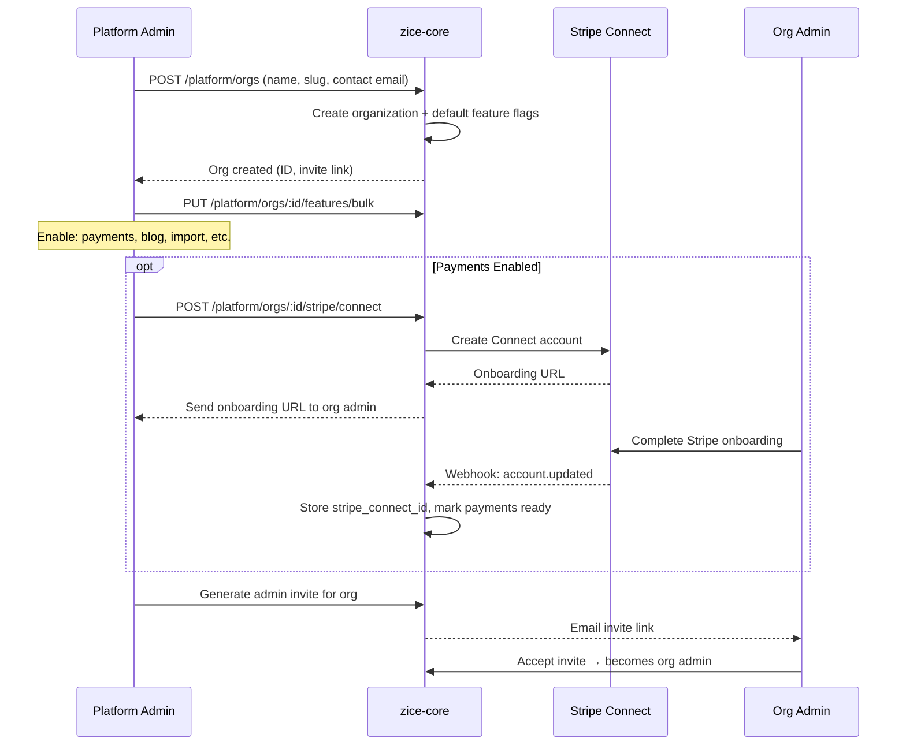
```mermaid
sequenceDiagram
    participant PA as Platform Admin
    participant API as zice-core
    participant Stripe as Stripe Connect
    participant OA as Org Admin

    PA->>API: POST /platform/orgs (name, slug, contact email)
    API->>API: Create organization + default feature flags
    API-->>PA: Org created (ID, invite link)

    PA->>API: PUT /platform/orgs/:id/features/bulk
    Note over PA: Enable: payments, blog, import, etc.

    opt Payments Enabled
        PA->>API: POST /platform/orgs/:id/stripe/connect
        API->>Stripe: Create Connect account
        Stripe-->>API: Onboarding URL
        API-->>PA: Send onboarding URL to org admin
        OA->>Stripe: Complete Stripe onboarding
        Stripe-->>API: Webhook: account.updated
        API->>API: Store stripe_connect_id, mark payments ready
    end

    PA->>API: Generate admin invite for org
    API-->>OA: Email invite link
    OA->>API: Accept invite → becomes org admin
```

### 22.10 Frontend Pages (Platform Admin)

| Route | Component | Description |
|---|---|---|
| `/platform` | `PlatformDashboard` | Overview: total orgs, users, revenue, recent activity |
| `/platform/orgs` | `PlatformOrgList` | All organizations with search, filter, status indicators |
| `/platform/orgs/:id` | `PlatformOrgDetail` | Org detail: settings, feature flags toggles, usage stats, Stripe status |
| `/platform/orgs/:id/features` | `PlatformFeatureFlags` | Toggle features on/off, configure limits per feature |
| `/platform/orgs/:id/stripe` | `PlatformStripeSetup` | Stripe Connect onboarding, status, disconnect |
| `/platform/orgs/new` | `PlatformOrgCreate` | Provision new org + initial feature setup |
| `/platform/admins` | `PlatformAdminList` | Manage platform admin accounts |
| `/platform/audit` | `PlatformAuditLog` | Platform-wide audit log with cross-org search |
| `/platform/finance` | `PlatformFinance` | Platform-wide financial overview (MRR, processing volume, payouts) |
| `/platform/impersonate` | `PlatformImpersonate` | User lookup + impersonation launcher |

### 22.11 PR Breakdown (Platform Admin)

| PR # | Title | Repo | Est. Size | Description |
|---|---|---|---|---|
| C19 | Platform admin schema — table, feature flags, RLS | zice-core | Medium | `platform_admins`, `org_feature_flags` tables, helper functions, RLS policies |
| C20 | Platform admin API + feature gating middleware | zice-core | Medium | Platform admin CRUD, org provisioning, feature flag management, `RequireFeature` middleware |
| C21 | Stripe Connect + impersonation endpoints | zice-core | Medium | Stripe Connect onboarding, status check, impersonation with audit logging |
| F15 | Platform admin dashboard + org management UI | zice-frontend | Medium | Platform dashboard, org list/detail, feature flag toggles |
| F16 | Platform Stripe setup + impersonation UI | zice-frontend | Medium | Stripe onboarding flow, impersonation banner + launcher |

---

## 23. Registration, Fees & Payment Processing

Players register for classes (clinics, camps, drop-ins, summer camps, etc.) or full seasons. Fees are collected upfront or via installment plans. The system supports tryout-first workflows where a non-refundable tryout fee is paid first and remaining fees are due only if the player makes the team.

### 23.1 Core Concepts

| Concept | Description |
|---|---|
| **Event** | A registrable activity: season, tryout, clinic, camp, drop-in, summer camp, etc. Fully configurable by org admins. |
| **Registration** | A player's enrollment in an event. Tracks status through the lifecycle: `pending` → `confirmed` → `completed` / `cancelled` / `waitlisted`. |
| **Fee Schedule** | The pricing structure for an event: total amount, installment plan, surcharges, discounts. Each event has exactly one fee schedule. |
| **Invoice** | An itemized bill for a registration. Generated automatically. Guardians/players can download for tax records. |
| **Payment** | A single transaction against an invoice. May be partial (installment) or full. |
| **Payment Processor** | Abstraction layer over Stripe (initial), swappable to Square, PayPal, etc. |

### 23.2 Database Schema

```sql
-- Registrable events (org-scoped)
CREATE TABLE events (
  id UUID PRIMARY KEY DEFAULT gen_random_uuid(),
  org_id UUID NOT NULL REFERENCES organizations(id),
  name TEXT NOT NULL,
  slug TEXT NOT NULL,
  description TEXT,
  event_type TEXT NOT NULL CHECK (event_type IN (
    'season', 'tryout', 'clinic', 'camp', 'drop_in', 'summer_camp', 'tournament', 'other'
  )),
  -- Linked season/tryout relationship
  parent_event_id UUID REFERENCES events(id),  -- e.g., tryout → season link
  team_designation TEXT,                        -- e.g., "14U Gold"
  season TEXT,                                  -- e.g., "2025-2026"
  -- Capacity
  capacity INT,                                 -- NULL = unlimited
  waitlist_enabled BOOLEAN NOT NULL DEFAULT false,
  -- Dates
  registration_opens_at TIMESTAMPTZ,
  registration_deadline TIMESTAMPTZ,            -- hard cutoff, no late registrations accepted
  starts_at TIMESTAMPTZ NOT NULL,
  ends_at TIMESTAMPTZ,
  -- Status
  status TEXT NOT NULL DEFAULT 'draft' CHECK (status IN ('draft', 'open', 'closed', 'cancelled')),
  created_at TIMESTAMPTZ NOT NULL DEFAULT now(),
  updated_at TIMESTAMPTZ NOT NULL DEFAULT now(),
  deleted_at TIMESTAMPTZ,
  UNIQUE (org_id, slug)
);

-- Fee schedules (one per event)
CREATE TABLE fee_schedules (
  id UUID PRIMARY KEY DEFAULT gen_random_uuid(),
  event_id UUID NOT NULL REFERENCES events(id) UNIQUE,
  total_amount_cents INT NOT NULL CHECK (total_amount_cents >= 0),
  currency TEXT NOT NULL DEFAULT 'usd',
  -- Installment configuration
  installments_enabled BOOLEAN NOT NULL DEFAULT false,
  installment_count INT CHECK (installment_count >= 2),
  installment_frequency TEXT CHECK (installment_frequency IN ('weekly', 'biweekly', 'monthly')),
  -- first installment can differ (e.g., larger deposit)
  first_installment_cents INT,
  -- Surcharges
  credit_card_surcharge_enabled BOOLEAN NOT NULL DEFAULT false,
  credit_card_surcharge_percent NUMERIC(5,3) CHECK (credit_card_surcharge_percent >= 0 AND credit_card_surcharge_percent <= 10),
  -- Refund policy
  refundable BOOLEAN NOT NULL DEFAULT true,
  refund_policy_description TEXT,              -- human-readable policy text
  refund_deadline TIMESTAMPTZ,                 -- after this date, no refunds
  -- Family/sibling discounts
  sibling_discount_enabled BOOLEAN NOT NULL DEFAULT false,
  sibling_discount_type TEXT CHECK (sibling_discount_type IN ('percent', 'fixed')),
  sibling_discount_value INT,                  -- percent (0-100) or cents
  sibling_discount_starts_at_child INT DEFAULT 2,  -- discount kicks in at Nth child
  created_at TIMESTAMPTZ NOT NULL DEFAULT now(),
  updated_at TIMESTAMPTZ NOT NULL DEFAULT now()
);

-- Registrations
CREATE TABLE registrations (
  id UUID PRIMARY KEY DEFAULT gen_random_uuid(),
  event_id UUID NOT NULL REFERENCES events(id),
  player_id UUID NOT NULL REFERENCES players(id),
  org_id UUID NOT NULL REFERENCES organizations(id),
  -- Who registered (guardian or adult player)
  registered_by UUID NOT NULL REFERENCES auth.users(id),
  -- Status lifecycle
  status TEXT NOT NULL DEFAULT 'pending' CHECK (status IN (
    'pending', 'confirmed', 'waitlisted', 'completed', 'cancelled', 'no_show'
  )),
  waitlist_position INT,                       -- NULL if not waitlisted
  -- Tryout → season promotion
  promoted_from_registration_id UUID REFERENCES registrations(id),
  -- Timestamps
  confirmed_at TIMESTAMPTZ,
  cancelled_at TIMESTAMPTZ,
  cancellation_reason TEXT,
  created_at TIMESTAMPTZ NOT NULL DEFAULT now(),
  updated_at TIMESTAMPTZ NOT NULL DEFAULT now(),
  deleted_at TIMESTAMPTZ,
  UNIQUE (event_id, player_id)
);

-- Invoices
CREATE TABLE invoices (
  id UUID PRIMARY KEY DEFAULT gen_random_uuid(),
  registration_id UUID NOT NULL REFERENCES registrations(id),
  org_id UUID NOT NULL REFERENCES organizations(id),
  -- Payer (guardian or adult player 18+)
  payer_user_id UUID NOT NULL REFERENCES auth.users(id),
  -- Amounts
  subtotal_cents INT NOT NULL,
  discount_cents INT NOT NULL DEFAULT 0,
  surcharge_cents INT NOT NULL DEFAULT 0,
  total_cents INT NOT NULL,
  currency TEXT NOT NULL DEFAULT 'usd',
  -- Discount details
  discount_type TEXT,                          -- 'sibling', 'custom', etc.
  discount_description TEXT,
  -- Status
  status TEXT NOT NULL DEFAULT 'draft' CHECK (status IN (
    'draft', 'sent', 'partially_paid', 'paid', 'overdue', 'refunded', 'void'
  )),
  due_date DATE,
  issued_at TIMESTAMPTZ,
  paid_at TIMESTAMPTZ,
  -- Invoice number for records
  invoice_number TEXT NOT NULL,
  -- PDF/receipt
  receipt_url TEXT,
  created_at TIMESTAMPTZ NOT NULL DEFAULT now(),
  updated_at TIMESTAMPTZ NOT NULL DEFAULT now(),
  deleted_at TIMESTAMPTZ
);

-- Invoice line items (for installments + itemization)
CREATE TABLE invoice_line_items (
  id UUID PRIMARY KEY DEFAULT gen_random_uuid(),
  invoice_id UUID NOT NULL REFERENCES invoices(id),
  description TEXT NOT NULL,
  amount_cents INT NOT NULL,
  item_type TEXT NOT NULL CHECK (item_type IN (
    'registration_fee', 'tryout_fee', 'installment', 'surcharge', 'discount', 'refund'
  )),
  due_date DATE,
  sort_order INT NOT NULL DEFAULT 0,
  created_at TIMESTAMPTZ NOT NULL DEFAULT now()
);

-- Payments (processor-agnostic)
CREATE TABLE payments (
  id UUID PRIMARY KEY DEFAULT gen_random_uuid(),
  invoice_id UUID NOT NULL REFERENCES invoices(id),
  -- Processor abstraction
  processor TEXT NOT NULL DEFAULT 'stripe',    -- 'stripe', 'square', 'paypal', etc.
  processor_payment_id TEXT,                   -- external ID (e.g., Stripe PaymentIntent ID)
  processor_fee_cents INT,                     -- processor's fee for this transaction
  -- Amounts
  amount_cents INT NOT NULL CHECK (amount_cents > 0),
  currency TEXT NOT NULL DEFAULT 'usd',
  -- Payment method
  payment_method TEXT NOT NULL CHECK (payment_method IN (
    'credit_card', 'debit_card', 'ach', 'check', 'cash', 'other'
  )),
  -- Credit card surcharge (tracked separately)
  surcharge_cents INT NOT NULL DEFAULT 0,
  -- Status
  status TEXT NOT NULL DEFAULT 'pending' CHECK (status IN (
    'pending', 'processing', 'succeeded', 'failed', 'refunded', 'partially_refunded'
  )),
  failure_reason TEXT,
  -- Refund tracking
  refund_amount_cents INT DEFAULT 0,
  refunded_at TIMESTAMPTZ,
  -- Timestamps
  paid_at TIMESTAMPTZ,
  created_at TIMESTAMPTZ NOT NULL DEFAULT now(),
  updated_at TIMESTAMPTZ NOT NULL DEFAULT now()
);

-- Indexes
CREATE INDEX idx_events_org_status ON events(org_id, status) WHERE deleted_at IS NULL;
CREATE INDEX idx_events_org_type ON events(org_id, event_type) WHERE deleted_at IS NULL;
CREATE INDEX idx_registrations_event ON registrations(event_id) WHERE deleted_at IS NULL;
CREATE INDEX idx_registrations_player ON registrations(player_id) WHERE deleted_at IS NULL;
CREATE INDEX idx_registrations_org ON registrations(org_id, status) WHERE deleted_at IS NULL;
CREATE INDEX idx_invoices_registration ON invoices(registration_id) WHERE deleted_at IS NULL;
CREATE INDEX idx_invoices_payer ON invoices(payer_user_id, status) WHERE deleted_at IS NULL;
CREATE INDEX idx_invoices_org ON invoices(org_id, status) WHERE deleted_at IS NULL;
CREATE INDEX idx_payments_invoice ON payments(invoice_id);
CREATE INDEX idx_payments_processor ON payments(processor, processor_payment_id);
CREATE UNIQUE INDEX idx_invoices_number ON invoices(org_id, invoice_number);
```

### 23.3 RLS Policies

```sql
-- events: org members can read open events
CREATE POLICY events_read ON events FOR SELECT
  USING (
    org_id IN (SELECT org_id FROM memberships WHERE user_id = auth.uid() AND deleted_at IS NULL)
    AND deleted_at IS NULL
  );

-- events: admins can create/update events
CREATE POLICY events_insert ON events FOR INSERT
  WITH CHECK (
    org_id IN (SELECT org_id FROM memberships WHERE user_id = auth.uid() AND role = 'admin' AND deleted_at IS NULL)
  );

CREATE POLICY events_update ON events FOR UPDATE
  USING (
    org_id IN (SELECT org_id FROM memberships WHERE user_id = auth.uid() AND role = 'admin' AND deleted_at IS NULL)
  );

-- registrations: guardians can register their players, adult players can self-register
CREATE POLICY registrations_insert ON registrations FOR INSERT
  WITH CHECK (
    registered_by = auth.uid()
    AND (
      -- Guardian registering their player
      EXISTS (SELECT 1 FROM player_guardians WHERE user_id = auth.uid() AND player_id = registrations.player_id
              AND 'financial' = ANY(permissions) AND is_active = true)
      OR
      -- Adult player (18+) self-registering
      EXISTS (SELECT 1 FROM players WHERE id = registrations.player_id AND player_user_id = auth.uid()
              AND EXTRACT(YEAR FROM age(dob)) >= 18)
    )
  );

-- registrations: org members can read their own registrations, admins can read all
CREATE POLICY registrations_read ON registrations FOR SELECT
  USING (
    deleted_at IS NULL AND (
      registered_by = auth.uid()
      OR EXISTS (SELECT 1 FROM memberships WHERE user_id = auth.uid() AND org_id = registrations.org_id AND role = 'admin' AND deleted_at IS NULL)
      -- Player can see own registration
      OR EXISTS (SELECT 1 FROM players WHERE id = registrations.player_id AND player_user_id = auth.uid())
    )
  );

-- registrations: admins can update status
CREATE POLICY registrations_update ON registrations FOR UPDATE
  USING (
    EXISTS (SELECT 1 FROM memberships WHERE user_id = auth.uid() AND org_id = registrations.org_id AND role = 'admin' AND deleted_at IS NULL)
    OR registered_by = auth.uid()  -- guardian can cancel
  );

-- invoices: payer or admin can read
CREATE POLICY invoices_read ON invoices FOR SELECT
  USING (
    deleted_at IS NULL AND (
      payer_user_id = auth.uid()
      OR EXISTS (SELECT 1 FROM memberships WHERE user_id = auth.uid() AND org_id = invoices.org_id AND role = 'admin' AND deleted_at IS NULL)
    )
  );

-- invoices: system/admin creates (via API, not direct user insert)
CREATE POLICY invoices_insert ON invoices FOR INSERT
  WITH CHECK (
    org_id IN (SELECT org_id FROM memberships WHERE user_id = auth.uid() AND role = 'admin' AND deleted_at IS NULL)
  );

-- payments: payer or admin can read
CREATE POLICY payments_read ON payments FOR SELECT
  USING (
    invoice_id IN (SELECT id FROM invoices WHERE payer_user_id = auth.uid() OR
      org_id IN (SELECT org_id FROM memberships WHERE user_id = auth.uid() AND role = 'admin' AND deleted_at IS NULL))
  );
```

### 23.4 Payment Processor Abstraction Layer

The payment system is designed processor-agnostic. The core domain logic never calls Stripe (or any processor) directly. Instead, a `PaymentProcessor` interface is implemented per provider.

```go
// internal/payments/processor.go
type PaymentProcessor interface {
    // CreatePaymentIntent initiates a payment
    CreatePaymentIntent(ctx context.Context, req PaymentRequest) (*PaymentResult, error)
    // ConfirmPayment confirms a pending payment (webhook-driven)
    ConfirmPayment(ctx context.Context, processorPaymentID string) (*PaymentResult, error)
    // RefundPayment issues a full or partial refund
    RefundPayment(ctx context.Context, processorPaymentID string, amountCents int) (*RefundResult, error)
    // GetPaymentStatus checks current status
    GetPaymentStatus(ctx context.Context, processorPaymentID string) (*PaymentStatus, error)
}

type PaymentRequest struct {
    AmountCents    int
    Currency       string
    Description    string
    CustomerEmail  string
    Metadata       map[string]string  // org_id, registration_id, invoice_id
    PaymentMethod  string             // "credit_card", "ach", etc.
    SurchargeCents int                // credit card surcharge if applicable
}

type PaymentResult struct {
    ProcessorPaymentID string
    Status             string  // "pending", "succeeded", "failed"
    ProcessorFeeCents  int
    ClientSecret       string  // for frontend confirmation (Stripe-specific, optional)
}

type RefundResult struct {
    ProcessorRefundID string
    Status            string
    AmountCents       int
}
```

**Initial implementation**: `StripeProcessor` using Stripe Go SDK.  
**Swapping processors**: Implement the interface for Square/PayPal/etc. Select via `organizations.metadata["payment_processor"]` or a dedicated config column. No domain logic changes required.

### 23.5 Registration Flows

#### Flow 1: Standard Season Registration

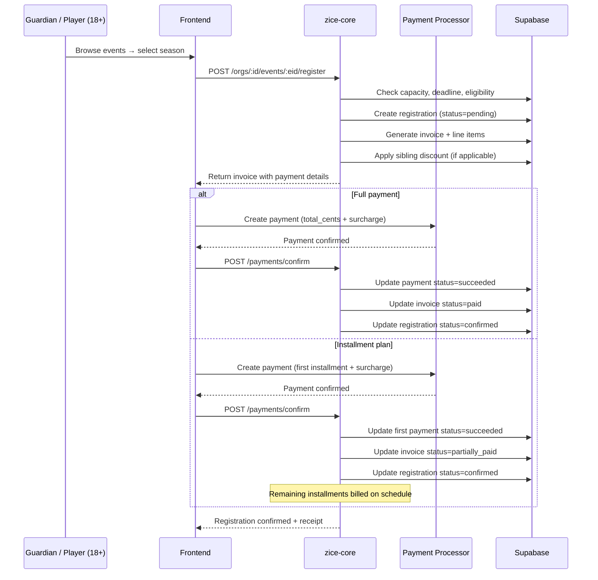
```mermaid
sequenceDiagram
    participant G as Guardian / Player (18+)
    participant FE as Frontend
    participant API as zice-core
    participant PP as Payment Processor
    participant DB as Supabase

    G->>FE: Browse events → select season
    FE->>API: POST /orgs/:id/events/:eid/register
    API->>DB: Check capacity, deadline, eligibility
    API->>DB: Create registration (status=pending)
    API->>DB: Generate invoice + line items
    API->>DB: Apply sibling discount (if applicable)
    API-->>FE: Return invoice with payment details

    alt Full payment
        FE->>PP: Create payment (total_cents + surcharge)
        PP-->>FE: Payment confirmed
        FE->>API: POST /payments/confirm
        API->>DB: Update payment status=succeeded
        API->>DB: Update invoice status=paid
        API->>DB: Update registration status=confirmed
    else Installment plan
        FE->>PP: Create payment (first installment + surcharge)
        PP-->>FE: Payment confirmed
        FE->>API: POST /payments/confirm
        API->>DB: Update first payment status=succeeded
        API->>DB: Update invoice status=partially_paid
        API->>DB: Update registration status=confirmed
        Note over API: Remaining installments billed on schedule
    end

    API-->>FE: Registration confirmed + receipt
```

#### Flow 2: Tryout → Season (Conditional Registration)

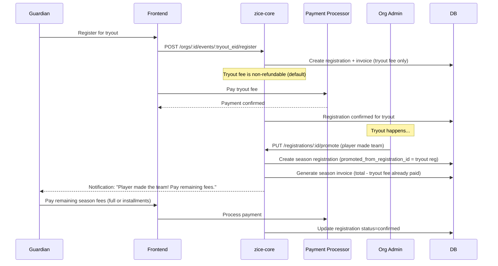
```mermaid
sequenceDiagram
    participant G as Guardian
    participant FE as Frontend
    participant API as zice-core
    participant PP as Payment Processor
    participant Admin as Org Admin

    G->>FE: Register for tryout
    FE->>API: POST /orgs/:id/events/:tryout_eid/register
    API->>DB: Create registration + invoice (tryout fee only)
    Note over API: Tryout fee is non-refundable (default)
    FE->>PP: Pay tryout fee
    PP-->>FE: Payment confirmed
    API->>DB: Registration confirmed for tryout

    Note over Admin: Tryout happens...

    Admin->>API: PUT /registrations/:id/promote (player made team)
    API->>DB: Create season registration (promoted_from_registration_id = tryout reg)
    API->>DB: Generate season invoice (total - tryout fee already paid)
    API-->>G: Notification: "Player made the team! Pay remaining fees."

    G->>FE: Pay remaining season fees (full or installments)
    FE->>PP: Process payment
    API->>DB: Update registration status=confirmed
```

#### Flow 3: Waitlist

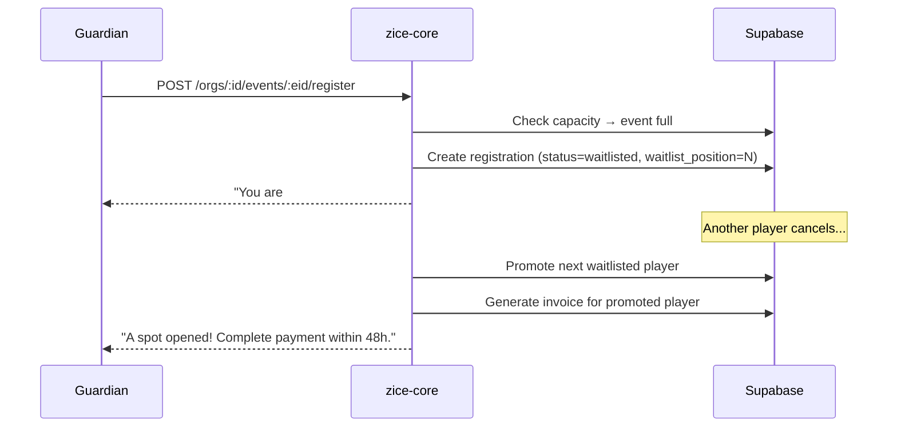
```mermaid
sequenceDiagram
    participant G as Guardian
    participant API as zice-core
    participant DB as Supabase

    G->>API: POST /orgs/:id/events/:eid/register
    API->>DB: Check capacity → event full
    API->>DB: Create registration (status=waitlisted, waitlist_position=N)
    API-->>G: "You are #N on the waitlist"

    Note over DB: Another player cancels...
    API->>DB: Promote next waitlisted player
    API->>DB: Generate invoice for promoted player
    API-->>G: "A spot opened! Complete payment within 48h."
```

### 23.6 Credit Card Surcharges

Surcharges are configurable per event via `fee_schedules.credit_card_surcharge_enabled` and `credit_card_surcharge_percent`.

**Rules:**
- Surcharge is only applied to credit card payments (not debit, ACH, check, or cash)
- Surcharge percentage is configurable per event (typical: 2.5–3.5%)
- Surcharge is itemized separately on the invoice (legal requirement in most US states)
- Surcharge is calculated at payment time: `surcharge_cents = CEIL(amount_cents * surcharge_percent / 100)`
- Tracked in both `invoice_line_items` (type=`surcharge`) and `payments.surcharge_cents`

### 23.7 Family / Sibling Discounts

When multiple players from the same family register for the same event:

**Calculation:**
1. Identify all registrations for the same event where `registered_by` is the same user (guardian) or players share a common guardian (via `player_guardians`)
2. Sort by registration `created_at` (first-come ordering)
3. Apply discount starting at the Nth child (`sibling_discount_starts_at_child`, default: 2nd child)
4. Discount type: `percent` (e.g., 10% off) or `fixed` (e.g., $50 off per additional sibling)

**Example:** Season fee = $2,000. Sibling discount = 15% starting at 2nd child.
- Child 1: $2,000 (full price)
- Child 2: $1,700 (15% off = $300 discount)
- Child 3: $1,700 (15% off = $300 discount)

### 23.8 Installment Plans

When `fee_schedules.installments_enabled = true`:

- **installment_count**: Number of payments (e.g., 4)
- **installment_frequency**: `weekly`, `biweekly`, or `monthly`
- **first_installment_cents**: Optional larger first payment (deposit). If NULL, all installments are equal.
- Invoice line items are generated for each installment with staggered `due_date` values
- First installment is collected at registration time
- Subsequent installments are billed on schedule (webhook or cron-triggered)
- Credit card surcharge applies to each individual installment payment

**Example:** $2,000 season fee, 4 monthly installments, $600 deposit:
1. Payment 1 (at registration): $600
2. Payment 2 (month 2): $466.67
3. Payment 3 (month 3): $466.67
4. Payment 4 (month 4): $466.66

### 23.9 Refund Policy

- **Default**: Refundable (configurable per event via `fee_schedules.refundable`)
- **Tryout fees**: Non-refundable by default (`refundable = false` on tryout events)
- **Refund deadline**: Optional date after which refunds are not issued (`refund_deadline`)
- **Refund processing**: Uses `PaymentProcessor.RefundPayment()` to issue refund through the original processor
- **Partial refunds**: Supported (e.g., refund remaining installments but keep what's already paid)
- **Surcharge refunds**: Credit card surcharges are NOT refunded (industry standard)
- **Cancellation**: Guardian/player can cancel registration. Admin can also cancel. Refund is processed per policy.

### 23.10 Invoicing & Receipts

- Invoices are auto-generated when a registration is created
- Each invoice has a unique `invoice_number` per org (format: `INV-{ORG_SLUG}-{YYYYMM}-{SEQ}`, e.g., `INV-JOLIET-202510-0001`)
- Line items break down: registration fee, discounts, surcharges, installments
- Guardians/players can download invoices as PDF for tax records
- Invoice statuses: `draft` → `sent` → `partially_paid` → `paid` (or `overdue`, `refunded`, `void`)
- Receipt URL is stored after successful payment for download

### 23.11 API Endpoints

```
# Events (admin management)
GET    /api/v1/orgs/:org_id/events                     # List events (filterable by type, status, season)
GET    /api/v1/orgs/:org_id/events/:id                  # Get event details + fee schedule
POST   /api/v1/orgs/:org_id/events                      # Create event (admin)
PUT    /api/v1/orgs/:org_id/events/:id                  # Update event (admin)
DELETE /api/v1/orgs/:org_id/events/:id                  # Soft-delete event (admin)
PUT    /api/v1/orgs/:org_id/events/:id/open             # Open registration (admin)
PUT    /api/v1/orgs/:org_id/events/:id/close            # Close registration (admin)

# Fee Schedules
GET    /api/v1/orgs/:org_id/events/:eid/fees            # Get fee schedule
PUT    /api/v1/orgs/:org_id/events/:eid/fees            # Create/update fee schedule (admin)

# Registrations
POST   /api/v1/orgs/:org_id/events/:eid/register       # Register player (guardian or self)
GET    /api/v1/orgs/:org_id/registrations               # List registrations (admin: all, user: own)
GET    /api/v1/registrations/:id                         # Get registration details
PUT    /api/v1/registrations/:id/cancel                  # Cancel registration (guardian/admin)
PUT    /api/v1/admin/registrations/:id/promote           # Promote from tryout to season (admin)
PUT    /api/v1/admin/registrations/:id/confirm           # Manually confirm registration (admin)
PUT    /api/v1/admin/registrations/:id/waitlist-promote  # Promote from waitlist (admin)

# Invoices
GET    /api/v1/invoices                                  # List my invoices (payer)
GET    /api/v1/orgs/:org_id/invoices                    # List org invoices (admin)
GET    /api/v1/invoices/:id                              # Get invoice details + line items
GET    /api/v1/invoices/:id/pdf                          # Download invoice PDF
PUT    /api/v1/admin/invoices/:id/void                   # Void invoice (admin)

# Payments
POST   /api/v1/invoices/:id/pay                          # Initiate payment (creates PaymentIntent)
POST   /api/v1/payments/webhook                          # Processor webhook (Stripe, etc.)
GET    /api/v1/invoices/:id/payments                     # List payments for invoice
POST   /api/v1/admin/payments/:id/refund                 # Issue refund (admin)

# Financial Reports (admin)
GET    /api/v1/orgs/:org_id/finance/summary              # Revenue summary (by event, period)
GET    /api/v1/orgs/:org_id/finance/outstanding          # Outstanding balances
```

### 23.12 Capacity & Waitlist Management

- `events.capacity`: NULL = unlimited, integer = max spots
- Registration check: `COUNT(registrations WHERE event_id = :eid AND status IN ('pending','confirmed')) < capacity`
- If full and `waitlist_enabled = true`: registration created with `status = 'waitlisted'` and `waitlist_position` auto-assigned
- When a confirmed player cancels: system auto-promotes the next waitlisted player (lowest `waitlist_position`)
- Promoted player receives notification and has a configurable window (default: 48 hours) to complete payment before the spot is offered to the next person

### 23.13 Role-Based Access Matrix

| Action | Admin | Coach | Guardian | Player (18+) |
|---|---|---|---|---|
| Create/edit events | ✓ | ✗ | ✗ | ✗ |
| Configure fees/discounts | ✓ | ✗ | ✗ | ✗ |
| View all registrations | ✓ | ✓ (read-only) | ✗ | ✗ |
| Register a player | ✗ | ✗ | ✓ (own players) | ✓ (self) |
| Cancel registration | ✓ (any) | ✗ | ✓ (own) | ✓ (own) |
| Make payment | ✗ | ✗ | ✓ | ✓ |
| View invoices | ✓ (all org) | ✗ | ✓ (own) | ✓ (own) |
| Issue refund | ✓ | ✗ | ✗ | ✗ |
| Promote from tryout | ✓ | ✗ | ✗ | ✗ |
| Manage waitlist | ✓ | ✗ | ✗ | ✗ |
| View financial reports | ✓ | ✗ | ✗ | ✗ |
| Download invoice/receipt | ✓ | ✗ | ✓ (own) | ✓ (own) |

### 23.14 Frontend Pages

| Route | Component | Description |
|---|---|---|
| `/events` | `EventList` | Browse open events (seasons, camps, clinics, etc.) |
| `/events/:slug` | `EventDetail` | Event info, fee breakdown, register button |
| `/events/:slug/register` | `RegistrationForm` | Player selection, payment method, review & pay |
| `/events/:slug/register/confirm` | `RegistrationConfirm` | Success page with receipt download |
| `/my/registrations` | `MyRegistrations` | Guardian/player view of all registrations + payment status |
| `/my/invoices` | `MyInvoices` | Invoice list with download links |
| `/my/invoices/:id` | `InvoiceDetail` | Itemized invoice view + pay button |
| `/admin/events` | `AdminEventList` | Event management (create, edit, open/close, capacity) |
| `/admin/events/:id` | `AdminEventDetail` | Edit event + fee schedule configuration |
| `/admin/events/:id/registrations` | `AdminRegistrations` | All registrations for event, promote/cancel/waitlist actions |
| `/admin/finance` | `AdminFinanceDashboard` | Revenue summary, outstanding balances, refund history |
| `/admin/finance/invoices` | `AdminInvoiceList` | All org invoices, filter by status |

### 23.15 PR Breakdown (Registration + Fees)

| PR # | Title | Repo | Est. Size | Description |
|---|---|---|---|---|
| C15 | Registration schema — events, registrations, invoices, payments | zice-core | Medium | Tables, RLS policies, indexes for all 6 new tables |
| C16 | Payment processor abstraction + Stripe implementation | zice-core | Medium | `PaymentProcessor` interface, `StripeProcessor`, webhook handler |
| C17 | Registration API endpoints + fee calculation engine | zice-core | Medium | Event CRUD, register, cancel, promote, waitlist, invoice generation |
| C18 | Invoice + payment API endpoints | zice-core | Medium | Pay, refund, PDF generation, financial reports |
| F12 | Event browsing + registration flow UI | zice-frontend | Medium | Event list, detail, registration form, payment integration |
| F13 | Invoice + payment management UI | zice-frontend | Medium | My registrations, invoices, payment history, receipt download |
| F14 | Admin event + finance management UI | zice-frontend | Medium | Admin event CRUD, fee config, registration management, finance dashboard |

---

## 24. Notifications System

Zice delivers notifications across **four channels** — email, SMS, push (mobile), and in-app (web) — with granular user preferences per channel per event type. Coaches and admins can send custom bulk messages to teams or filtered groups.

### 24.1 Notification Channels

| Channel | Transport | Provider (Phase 1) | Fallback |
|---|---|---|---|
| **Email** | SMTP / API | Resend (or SendGrid) | Supabase Auth emails for auth events |
| **SMS** | API | Twilio | None — SMS is opt-in only |
| **Push** | FCM / APNs | Firebase Cloud Messaging | Falls back to in-app if no device token |
| **In-App** | WebSocket / polling | Supabase Realtime (or custom) | Always available when user is logged in |

### 24.2 Notification Event Types

| Category | Event | Default Channels | Sender |
|---|---|---|---|
| **Registration** | Registration confirmed | Email, In-App | System |
| | Registration cancelled | Email, In-App | System |
| | Waitlist position update | Email, In-App | System |
| | Waitlist promoted — action required | Email, SMS, Push, In-App | System |
| **Payments** | Payment received / receipt | Email, In-App | System |
| | Payment failed / retry needed | Email, SMS, Push, In-App | System |
| | Installment due reminder (7 days, 1 day) | Email, Push, In-App | System |
| | Installment overdue | Email, SMS, Push, In-App | System |
| | Refund processed | Email, In-App | System |
| **Schedule** | Game/practice created | Email, Push, In-App | System |
| | Game/practice time or location changed | Email, SMS, Push, In-App | System |
| | Game/practice cancelled | Email, SMS, Push, In-App | System |
| | Game result posted | Push, In-App | System |
| **Team** | Player added to roster | Email, In-App | System |
| | Player removed from roster | Email, In-App | System |
| | Roster finalized | Email, Push, In-App | System |
| **Blog** | New post published | Push, In-App | System |
| | Comment reply on your post/comment | Push, In-App | System |
| **Admin/Coach Messages** | Custom announcement to team | Email, Push, In-App | Coach/Admin |
| | Direct message to individual | Email, Push, In-App | Coach/Admin |
| | Urgent alert (all channels forced) | Email, SMS, Push, In-App | Admin |
| **Account Security** | Password changed | Email | System |
| | New device login | Email, Push | System |
| | Passkey registered/removed | Email | System |
| **Compliance** | NGB registration expiring | Email, In-App | System |
| | Missing required documents | Email, In-App | System |
| | SafeSport certification due | Email, In-App | System |
| **Invitations** | Invited to organization | Email | System |
| | Guardian link request | Email, Push, In-App | System |

### 24.3 Database Schema

#### `public.notification_templates`

| Column | Type | Constraints | Description |
|---|---|---|---|
| `id` | `uuid` | PK | |
| `event_type` | `text` | NOT NULL, UNIQUE | e.g., `registration.confirmed`, `schedule.game_changed` |
| `subject_template` | `text` | NOT NULL | Handlebars template for email subject |
| `body_email` | `text` | NOT NULL | HTML template for email body |
| `body_sms` | `text` | NOT NULL | Plain text template for SMS (160 char target) |
| `body_push` | `text` | NOT NULL | Short text for push notification |
| `body_inapp` | `text` | NOT NULL | Markdown/text for in-app notification |
| `default_channels` | `text[]` | NOT NULL | Default channels: `{email, sms, push, inapp}` |
| `force_channels` | `text[]` | DEFAULT `'{}'` | Channels that CANNOT be disabled by user (e.g., security events) |
| `created_at` | `timestamptz` | DEFAULT `now()` | |
| `updated_at` | `timestamptz` | DEFAULT `now()` | |

#### `public.notification_preferences`

| Column | Type | Constraints | Description |
|---|---|---|---|
| `id` | `uuid` | PK | |
| `user_id` | `uuid` | FK → `auth.users(id)`, NOT NULL | |
| `event_type` | `text` | NOT NULL | Matches `notification_templates.event_type` |
| `channel_email` | `boolean` | NOT NULL, DEFAULT `true` | |
| `channel_sms` | `boolean` | NOT NULL, DEFAULT `false` | SMS is opt-in |
| `channel_push` | `boolean` | NOT NULL, DEFAULT `true` | |
| `channel_inapp` | `boolean` | NOT NULL, DEFAULT `true` | |
| `created_at` | `timestamptz` | DEFAULT `now()` | |
| `updated_at` | `timestamptz` | DEFAULT `now()` | |

> **Unique constraint:** `(user_id, event_type)`. If no row exists for a user+event, the system uses `notification_templates.default_channels`.

#### `public.notifications`

| Column | Type | Constraints | Description |
|---|---|---|---|
| `id` | `uuid` | PK | |
| `org_id` | `uuid` | FK → `organizations(id)`, NOT NULL | Tenant scoping |
| `user_id` | `uuid` | FK → `auth.users(id)`, NOT NULL | Recipient |
| `event_type` | `text` | NOT NULL | e.g., `schedule.game_changed` |
| `title` | `text` | NOT NULL | Rendered notification title |
| `body` | `text` | NOT NULL | Rendered notification body |
| `data` | `jsonb` | DEFAULT `'{}'` | Structured payload (e.g., `{game_id, old_time, new_time}`) |
| `channels_sent` | `text[]` | NOT NULL | Which channels were actually sent |
| `read_at` | `timestamptz` | NULLABLE | When user read the in-app notification |
| `clicked_at` | `timestamptz` | NULLABLE | When user clicked through |
| `created_at` | `timestamptz` | DEFAULT `now()` | |

> **RLS:** Users can only read/update their own notifications. Admins can read all notifications for their org.

#### `public.notification_deliveries`

| Column | Type | Constraints | Description |
|---|---|---|---|
| `id` | `uuid` | PK | |
| `notification_id` | `uuid` | FK → `notifications(id)`, NOT NULL | |
| `channel` | `text` | NOT NULL | `email`, `sms`, `push`, `inapp` |
| `status` | `text` | NOT NULL, DEFAULT `'pending'` | `pending`, `sent`, `delivered`, `failed`, `bounced` |
| `provider_id` | `text` | NULLABLE | External ID from provider (Resend message ID, Twilio SID, etc.) |
| `error` | `text` | NULLABLE | Error message if failed |
| `sent_at` | `timestamptz` | NULLABLE | |
| `delivered_at` | `timestamptz` | NULLABLE | |
| `created_at` | `timestamptz` | DEFAULT `now()` | |

#### `public.device_tokens`

| Column | Type | Constraints | Description |
|---|---|---|---|
| `id` | `uuid` | PK | |
| `user_id` | `uuid` | FK → `auth.users(id)`, NOT NULL | |
| `platform` | `text` | NOT NULL | `ios`, `android`, `web` |
| `token` | `text` | NOT NULL | FCM/APNs device token |
| `is_active` | `boolean` | DEFAULT `true` | Deactivated on uninstall or token refresh |
| `last_used_at` | `timestamptz` | NULLABLE | |
| `created_at` | `timestamptz` | DEFAULT `now()` | |

> **Unique constraint:** `(user_id, platform, token)`

### 24.4 Notification Dispatch Architecture

```mermaid
flowchart TD
    A[Event Occurs] --> B[NotificationService.Send]
    B --> C{Resolve Recipients}
    C --> D[Query notification_preferences]
    D --> E{For each recipient}
    E --> F{For each enabled channel}
    F -->|Email| G[EmailProvider.Send]
    F -->|SMS| H[SMSProvider.Send]
    F -->|Push| I[PushProvider.Send]
    F -->|In-App| J[Insert into notifications table]
    G --> K[notification_deliveries]
    H --> K
    I --> K
    J --> K
    K --> L[Supabase Realtime → WebSocket]
```

### 24.5 Recipient Resolution

Notifications are sent to the right people based on the event context:

| Event Context | Recipients |
|---|---|
| Player-specific (roster change, compliance) | All active guardians of the player (`player_guardians WHERE is_active = true`) + player themselves if age 13+ |
| Team-wide (schedule change, blog post) | All members of the org with relevant roles |
| Org-wide (admin announcement) | All org members |
| Financial (payment, invoice) | Guardian(s) with `financial` permission for the player + player if 18+ |
| Security (password change, login) | The specific user only |
| Custom message (coach sends) | Target audience selected by sender (whole team, guardians only, specific group) |

### 24.6 Bulk Messaging (Coach/Admin)

Coaches and admins can send custom messages to teams or filtered groups:

```
POST /api/v1/orgs/:org_id/messages
{
  "audience": "team",              // "team" | "guardians" | "coaches" | "all" | "custom"
  "team_id": "uuid",               // optional — filter by team
  "user_ids": ["uuid", ...],       // optional — for "custom" audience
  "subject": "Practice cancelled tonight",
  "body": "Due to weather, practice is cancelled...",
  "channels": ["email", "push"],   // override default channels
  "urgent": false                   // true = force all channels including SMS
}
```

**Permissions:**
- **Admins**: Can message anyone in the org, including urgent (all channels)
- **Coaches**: Can message their own team members only, cannot send urgent
- **Parents/Players**: Cannot send bulk messages (use direct messaging in future iteration)

### 24.7 User Notification Preferences UI

Accessible at `/settings/notifications`:

```
┌──────────────────────────────────────────────────────────┐
│  Notification Preferences                                │
├──────────────────────────────────────────────────────────┤
│                          Email  SMS  Push  In-App        │
│  ─── Registration ───                                    │
│  Registration confirmed    ✓     ☐    ✓     ✓           │
│  Waitlist updates          ✓     ☐    ✓     ✓           │
│  ─── Payments ───                                        │
│  Payment received          ✓     ☐    ☐     ✓           │
│  Payment due reminder      ✓     ☐    ✓     ✓           │
│  Payment overdue           ✓     ✓    ✓     ✓    🔒     │
│  ─── Schedule ───                                        │
│  Game/practice changes     ✓     ✓    ✓     ✓           │
│  Game cancelled            ✓     ✓    ✓     ✓    🔒     │
│  ─── Team ───                                            │
│  Roster changes            ✓     ☐    ✓     ✓           │
│  ─── Blog ───                                            │
│  New post published        ☐     ☐    ✓     ✓           │
│  Comment replies           ☐     ☐    ✓     ✓           │
│  ─── Security ───                                        │
│  Password/passkey changes  ✓     ☐    ☐     ☐    🔒     │
│  New device login          ✓     ☐    ✓     ☐    🔒     │
└──────────────────────────────────────────────────────────┘
  🔒 = forced by system, cannot be disabled
```

### 24.8 In-App Notification Center

- **Bell icon** in the top nav bar with unread count badge
- **Notification drawer** slides in from right with grouped notifications
- **Mark as read**: Individual or "mark all as read"
- **Click-through**: Each notification links to the relevant page (e.g., game detail, invoice, blog post)
- **Real-time updates**: Supabase Realtime subscription on `notifications` table filtered by `user_id`
- **Retention**: Notifications older than 90 days are archived (not deleted)

### 24.9 SMS Consent & Compliance

- SMS is **opt-in only** — never enabled by default
- Users must explicitly enable SMS per event type in notification preferences
- First SMS to a user includes opt-out instructions: "Reply STOP to unsubscribe"
- All SMS consent changes are audit-logged
- TCPA compliant: Consent recorded with timestamp, IP, and user agent
- Admin "urgent" messages override user SMS preferences but are audit-logged and rate-limited (max 1 per 24 hours per org)

### 24.10 Rate Limiting & Deduplication

| Rule | Limit |
|---|---|
| Per-user per-channel per-hour | 10 notifications |
| Per-user SMS per-day | 5 messages |
| Admin urgent broadcasts per-org per-day | 1 |
| Deduplication window | 5 minutes (same event_type + user_id + data hash) |
| Batch digest | If >3 notifications of same type within 15 min, batch into digest email |

### 24.11 Notification Provider Abstraction

```go
// NotificationProvider defines the interface for each channel
type NotificationProvider interface {
    Send(ctx context.Context, recipient Recipient, message Message) (*DeliveryResult, error)
    BatchSend(ctx context.Context, recipients []Recipient, message Message) ([]DeliveryResult, error)
    CheckStatus(ctx context.Context, providerID string) (*DeliveryStatus, error)
}

// Implementations
type ResendEmailProvider struct { ... }      // Email via Resend API
type TwilioSMSProvider struct { ... }        // SMS via Twilio
type FCMPushProvider struct { ... }          // Push via Firebase Cloud Messaging
type SupabaseRealtimeProvider struct { ... } // In-app via Supabase Realtime
```

Provider is swappable per channel (e.g., switch from Resend to SendGrid for email without changing dispatch logic).

### 24.12 API Endpoints

```
# User notifications
GET    /api/v1/notifications                           # List my notifications (paginated, filterable)
GET    /api/v1/notifications/unread-count               # Unread count for badge
PUT    /api/v1/notifications/:id/read                   # Mark as read
PUT    /api/v1/notifications/read-all                   # Mark all as read

# Notification preferences
GET    /api/v1/notifications/preferences                # Get my preferences
PUT    /api/v1/notifications/preferences                # Update preferences (batch)
PUT    /api/v1/notifications/preferences/:event_type    # Update single event type

# Device tokens (push notifications)
POST   /api/v1/devices                                  # Register device token
DELETE /api/v1/devices/:id                              # Unregister device token

# Admin: bulk messaging
POST   /api/v1/orgs/:org_id/messages                   # Send custom message (admin/coach)
GET    /api/v1/orgs/:org_id/messages                    # List sent messages (admin)

# Admin: notification analytics
GET    /api/v1/orgs/:org_id/notifications/stats          # Delivery stats (sent, delivered, failed, open rate)
```

### 24.13 Frontend Pages

| Route | Component | Description |
|---|---|---|
| `/settings/notifications` | `NotificationPreferences` | Per-event-type, per-channel toggle grid |
| (global) | `NotificationBell` | Top nav bell icon with unread badge |
| (global) | `NotificationDrawer` | Slide-in panel with notification list |
| `/admin/messages` | `AdminMessageComposer` | Compose + send custom messages to team/groups |
| `/admin/messages/history` | `AdminMessageHistory` | Sent message log with delivery stats |

### 24.14 PR Breakdown (Notifications)

| PR # | Title | Repo | Est. Size | Description |
|---|---|---|---|---|
| C22 | Notification schema — templates, preferences, deliveries, device tokens | zice-core | Medium | Tables, RLS policies, seed templates for all event types |
| C23 | Notification dispatch engine + provider abstraction | zice-core | Medium | `NotificationService`, provider interfaces, recipient resolution, rate limiting, deduplication |
| C24 | Email + SMS providers (Resend + Twilio) | zice-core | Medium | `ResendEmailProvider`, `TwilioSMSProvider`, template rendering, SMS consent tracking |
| C25 | Push notifications + in-app (FCM + Supabase Realtime) | zice-core | Medium | `FCMPushProvider`, `SupabaseRealtimeProvider`, device token management |
| C26 | Bulk messaging API + notification analytics | zice-core | Small | Admin/coach message endpoints, delivery stats, audience resolution |
| F17 | Notification preferences UI + bell/drawer components | zice-frontend | Medium | Preferences grid, `NotificationBell`, `NotificationDrawer`, Supabase Realtime subscription |
| F18 | Admin message composer + history UI | zice-frontend | Medium | Compose form with audience picker, sent message log, delivery stats dashboard |

---

## 25. NGB Registration & Verification

Zice generalizes the USA Hockey registration concept into a **multi-sport NGB (National Governing Body) registration model**. This makes the platform sport-agnostic — any sport with a governing body that issues member IDs can be supported.

### 25.1 Supported NGBs (Current & Planned)

| NGB | Sport | ID Format | Validation Fields | API Available? |
|---|---|---|---|---|
| **USA Hockey** | Ice Hockey | 14-char alphanumeric | Number + first name + last name + DOB + season | Private partnership API only |
| **USA Lacrosse** | Lacrosse | 14-char alphanumeric | Number + last name + DOB + zip | Private partnership API only |
| **USA Swimming** | Swimming | 14-char algorithmic (mmddyyFIRMILAST) | Number + name + DOB | No API — managed via hub.usaswimming.org |
| **US Club Soccer** | Soccer | FIFA Player ID (variable length) | Document-based (birth cert upload) | No API — managed via GotSport |
| **AAU** | Multi-sport | AAU Membership Number | Number + age/grade verification | No API |
| **USA Gymnastics** | Gymnastics | USAG Member ID | Number + club affiliation | No API |
| **USA Football** | Football | Membership number | Number + age/weight | No API |
| **Hockey Canada** | Ice Hockey (CA) | HC Number | Number + name + DOB | Private partnership API |

### 25.2 Database Schema

#### `public.ngb_types` (reference table)

| Column | Type | Constraints | Description |
|---|---|---|---|
| `id` | `text` | PK | e.g., `usa_hockey`, `usa_lacrosse`, `us_club_soccer` |
| `name` | `text` | NOT NULL | Display name: "USA Hockey" |
| `sport` | `text` | NOT NULL | e.g., `ice_hockey`, `lacrosse`, `soccer` |
| `id_format_regex` | `text` | NOT NULL | Regex for format validation: `^[A-Za-z0-9]{14}$` |
| `id_format_description` | `text` | NOT NULL | Human-readable: "14-character alphanumeric" |
| `verification_fields` | `text[]` | NOT NULL | Fields needed for API verification: `{first_name, last_name, dob, season}` |
| `verification_method` | `text` | NOT NULL | `api`, `document`, `manual` |
| `api_available` | `boolean` | DEFAULT `false` | Whether Zice has API integration access |
| `website_url` | `text` | NULLABLE | Registration website URL |
| `created_at` | `timestamptz` | DEFAULT `now()` | |

#### `public.ngb_registrations` (replaces `usa_hockey_id` column)

| Column | Type | Constraints | Description |
|---|---|---|---|
| `id` | `uuid` | PK | |
| `player_id` | `uuid` | FK → `players(id)`, NOT NULL | |
| `ngb_type` | `text` | FK → `ngb_types(id)`, NOT NULL | e.g., `usa_hockey` |
| `registration_number` | `text` | NOT NULL | The NGB-issued ID |
| `season` | `text` | NULLABLE | e.g., `2025-26` |
| `status` | `text` | NOT NULL, DEFAULT `'unverified'` | `unverified`, `verified`, `expired`, `invalid` |
| `verified_at` | `timestamptz` | NULLABLE | When verification succeeded |
| `verified_by` | `uuid` | FK → `auth.users(id)`, NULLABLE | Admin who manually verified, or NULL for API |
| `verification_method` | `text` | NOT NULL, DEFAULT `'format_only'` | `format_only`, `manual`, `api`, `document` |
| `verification_data` | `jsonb` | DEFAULT `'{}'` | API response or document metadata |
| `expires_at` | `timestamptz` | NULLABLE | When the registration expires (season end) |
| `created_at` | `timestamptz` | DEFAULT `now()` | |
| `updated_at` | `timestamptz` | DEFAULT `now()` | |
| `deleted_at` | `timestamptz` | NULLABLE | Soft delete |

> **Unique constraint:** `(player_id, ngb_type, season)` — one registration per NGB per season per player.  
> **CHECK constraint:** `registration_number` is validated against `ngb_types.id_format_regex` at the application layer (regexes vary per NGB type).  
> **Migration note:** The existing `players.usa_hockey_id` column will be migrated to `ngb_registrations` rows with `ngb_type = 'usa_hockey'`. The column is kept as a read-only computed alias during transition.

### 25.3 Verification Flow

```mermaid
flowchart TD
    A[Player Registration Input] --> B{NGB Type Selected?}
    B -->|Yes| C[Format Validation<br/>regex check]
    C -->|Invalid Format| D[Error: Invalid ID format]
    C -->|Valid Format| E{API Integration Available?}
    E -->|Yes| F[API Verification<br/>Send: number + name + DOB + season]
    E -->|No| G[Store as format_only<br/>Admin can manually verify]
    F -->|Valid| H[Status: verified<br/>Store API response]
    F -->|Invalid| I[Status: invalid<br/>Show error to user]
    G --> J[Status: unverified<br/>Flag for admin review]
    H --> K[Done]
    I --> L[User corrects and retries]
    J --> M[Admin verifies manually<br/>or via USAH Registry portal]
    M --> N[Status: verified<br/>verified_by = admin_id]
```

### 25.4 NGB Verification Provider Interface

```go
// NGBVerificationProvider defines the interface for NGB API integrations
type NGBVerificationProvider interface {
    // Verify checks a registration number against the NGB's database
    Verify(ctx context.Context, req VerificationRequest) (*VerificationResult, error)
    // SupportsSeasonCheck returns true if the NGB API validates season eligibility
    SupportsSeasonCheck() bool
}

type VerificationRequest struct {
    RegistrationNumber string
    FirstName          string
    LastName           string
    DOB                time.Time
    Season             string // e.g., "2025-26"
}

type VerificationResult struct {
    Valid           bool
    MembershipType  string // e.g., "Youth - Competitive"
    ExpiresAt       *time.Time
    SeasonEligible  bool
    ErrorMessage    string
    RawResponse     json.RawMessage // Store for audit
}

// Future implementations (requires partnership agreements)
type USAHockeyProvider struct { apiKey string; baseURL string }
type USALacrosseProvider struct { apiKey string; baseURL string }
type HockeyCanadaProvider struct { apiKey string; baseURL string }
```

### 25.5 Org-Level NGB Configuration

Organizations configure which NGB(s) their sport requires:

```
POST /api/v1/admin/orgs/:org_id/ngb-requirements
{
  "ngb_type": "usa_hockey",
  "required": true,           // Players must have a valid registration
  "enforce_verification": false,  // true = block roster if unverified
  "season": "2025-26"
}
```

- **Required + not enforced** (default): Admin sees warnings for unverified players but can proceed
- **Required + enforced**: Players cannot be added to official rosters without a verified NGB registration
- **Not required**: NGB field is optional during registration

### 25.6 API Endpoints

```
# NGB types (reference data)
GET    /api/v1/ngb-types                                # List all supported NGBs

# Player NGB registrations
GET    /api/v1/players/:id/ngb-registrations             # List player's NGB registrations
POST   /api/v1/players/:id/ngb-registrations             # Add NGB registration
PUT    /api/v1/players/:id/ngb-registrations/:rid         # Update registration number
DELETE /api/v1/players/:id/ngb-registrations/:rid         # Soft-delete registration

# Verification
POST   /api/v1/players/:id/ngb-registrations/:rid/verify  # Trigger verification (API or manual)

# Admin: org NGB requirements
GET    /api/v1/admin/orgs/:org_id/ngb-requirements       # Get org NGB config
PUT    /api/v1/admin/orgs/:org_id/ngb-requirements       # Set org NGB config

# Admin: compliance dashboard
GET    /api/v1/admin/orgs/:org_id/ngb-compliance         # List players with verification status
```

### 25.7 Frontend Pages

| Route | Component | Description |
|---|---|---|
| `/admin/compliance` | `NGBComplianceDashboard` | Table of all players with NGB verification status, filters (verified/unverified/expired), bulk verify button |
| `/admin/compliance/settings` | `NGBRequirementSettings` | Configure which NGBs are required, enforcement mode, season |
| `/players/:id` (section) | `NGBRegistrationCard` | Player profile section showing NGB IDs with status badges (verified/unverified/expired) |
| `/settings/ngb` | `MyNGBRegistrations` | Player/guardian view of their NGB registrations |

### 25.8 Future: NGB API Partnership Integration

When Zice secures API partnership access with an NGB:

1. **Contact**: USA Hockey — Chris Smith (chriss@usahockey.org, ext 139). USA Lacrosse — through their "Preferred Platform Partners" program.
2. **Implementation**: Add a new `NGBVerificationProvider` implementation (e.g., `USAHockeyProvider`)
3. **Configuration**: Set `api_available = true` in `ngb_types`, deploy provider with API credentials
4. **User experience**: Registration form auto-validates in real-time; "Verified ✓" badge appears instantly
5. **Caching**: Verification results cached for the season duration — no re-verification needed until season changes

This is planned for Milestone 3+ under the `zice-compliance` service extraction.

### 25.9 Migration from `usa_hockey_id`

```sql
-- Migrate existing usa_hockey_id data to ngb_registrations
INSERT INTO ngb_registrations (player_id, ngb_type, registration_number, status, verification_method)
SELECT id, 'usa_hockey', usa_hockey_id, 'unverified', 'format_only'
FROM players
WHERE usa_hockey_id IS NOT NULL AND deleted_at IS NULL;

-- Keep usa_hockey_id as read-only alias (computed view or trigger)
-- Remove in a future migration once all consumers use ngb_registrations
```

### 25.10 PR Breakdown (NGB Registration)

| PR # | Title | Repo | Est. Size | Description |
|---|---|---|---|---|
| C27 | NGB registration schema — ngb_types, ngb_registrations, migration | zice-core | Medium | Tables, RLS policies, seed NGB types, migrate usa_hockey_id data |
| C28 | NGB verification engine + provider interface | zice-core | Medium | `NGBVerificationProvider` interface, format validation, manual verification endpoint |
| F19 | NGB compliance dashboard + player registration UI | zice-frontend | Medium | Compliance dashboard, requirement settings, player profile NGB card |

---

## 26. PR Breakdown Strategy

Following the constraint of Small (26-200 LOC) to Medium (201-500 LOC) PRs:

### `zice-core` PRs

| PR # | Title | Milestone | Est. Size | Description |
|---|---|---|---|---|
| C1 | Scaffold Go project + Makefile + Docker | M2 | Small | Go module, project structure, Makefile (`make dev`/`test`/`check`), Dockerfile, docker-compose |
| C2 | Foundation schema (tables, indexes, triggers) | M2 | Medium | `organizations`, `players`, `player_guardians`, `guardian_audit_log`, `memberships`, `rosters` + indexes + triggers |
| C3 | RLS policies + helper functions | M2 | Medium | All RLS policies, `get_player_age_tier`, `is_guardian_of`, `guardian_has_permission`, etc. |
| C4 | Core API handlers + OpenAPI spec | M2 | Medium | REST endpoints for organizations, players, guardians, memberships, rosters + Swagger docs |
| C5 | Auth + tenant middleware | M2 | Small | JWT validation, X-Org-ID extraction, CORS |
| C6 | Auth API endpoints + invite system | M2 | Medium | Signup/login proxy, magic link, invite CRUD, accept invite, profile endpoints |
| C7 | Dev seeder — test data | M2 | Medium | Pre-generated seed data: 15-player roster, 10-game schedule, 3 users, guardians |
| C8 | Admin RLS policies for import | M2 | Small | `admin_insert_players`, `admin_update_players`, `admin_insert_guardians` policies |
| C9 | Admin bulk import API endpoints | M2 | Medium | `POST /orgs/:id/import/roster`, `POST /orgs/:id/import/guardians`, import history |
| C10 | Soft-delete migration + RLS updates | M2 | Medium | `deleted_at` columns, partial indexes, updated RLS policies with `deleted_at IS NULL` |
| C11 | User audit log — table, middleware, API | M2 | Medium | `audit_log` table, Go middleware, sensitive field redaction, admin query endpoints |
| C12 | Password validation + passkey support | M2 | Small | `ValidatePassword` policy enforcement in auth handler, passkey JWT acceptance |
| C13 | Admin CRUD API — soft-delete + restore endpoints | M2 | Medium | DELETE (soft), PUT restore, `?include_deleted` query param across all entity handlers |
| C14 | Team Blog — schema, RLS, API endpoints | M3 | Medium | `blog_posts`, `blog_comments`, `blog_media` tables, RLS policies, 16 REST endpoints |
| C15 | Registration schema — events, registrations, invoices, payments | M3 | Medium | Tables, RLS policies, indexes for all 6 new tables |
| C16 | Payment processor abstraction + Stripe implementation | M3 | Medium | `PaymentProcessor` interface, `StripeProcessor`, webhook handler |
| C17 | Registration API endpoints + fee calculation engine | M3 | Medium | Event CRUD, register, cancel, promote, waitlist, invoice generation |
| C18 | Invoice + payment API endpoints | M3 | Medium | Pay, refund, PDF generation, financial reports |
| C19 | Platform admin schema — table, feature flags, RLS | M3 | Medium | `platform_admins`, `org_feature_flags` tables, helper functions, RLS policies |
| C20 | Platform admin API + feature gating middleware | M3 | Medium | Platform admin CRUD, org provisioning, feature flag management, `RequireFeature` middleware |
| C21 | Stripe Connect + impersonation endpoints | M3 | Medium | Stripe Connect onboarding, status check, impersonation with audit logging |
| C22 | Notification schema — templates, preferences, deliveries, device tokens | M3 | Medium | Tables, RLS policies, seed templates for all event types |
| C23 | Notification dispatch engine + provider abstraction | M3 | Medium | `NotificationService`, provider interfaces, recipient resolution, rate limiting |
| C24 | Email + SMS providers (Resend + Twilio) | M3 | Medium | `ResendEmailProvider`, `TwilioSMSProvider`, template rendering, consent tracking |
| C25 | Push notifications + in-app (FCM + Supabase Realtime) | M3 | Medium | `FCMPushProvider`, `SupabaseRealtimeProvider`, device token management |
| C26 | Bulk messaging API + notification analytics | M3 | Small | Admin/coach message endpoints, delivery stats, audience resolution |
| C27 | NGB registration schema — ngb_types, ngb_registrations, migration | M3 | Medium | Tables, RLS, seed NGB types, migrate usa_hockey_id |
| C28 | NGB verification engine + provider interface | M3 | Medium | `NGBVerificationProvider` interface, format validation, manual verification |

### `zice-frontend` PRs

| PR # | Title | Milestone | Est. Size | Description |
|---|---|---|---|---|
| F1 | Scaffold Next.js app + Makefile + Tailwind | M1/M2 | Small | Next.js skeleton, Tailwind, tsconfig, Makefile (`make dev`/`test`/`check`), env config |
| F2 | Multi-tenant middleware | M2 | Small | `middleware.ts` with subdomain/BYOD custom-domain resolution |
| F3 | Roster Auditor — CSV parsing + matching engine | M1 | Medium | PapaParse wrapper, fuzzy matcher, USA Hockey ID validator, TypeScript types |
| F4 | Roster Auditor — UI components + page | M1 | Medium | Drop zones, dashboard table, summary cards, export button, privacy banner |
| F5 | Auth UI — login, signup, onboarding | M2 | Medium | Login/signup pages, OAuth buttons, onboarding wizard, invite acceptance, auth middleware |
| F6 | Password strength meter + passkey UI | M2 | Medium | `PasswordStrengthMeter`, `PasskeyLoginButton`, `PasskeyRegister`, `PasskeyList`, security settings page |
| F7 | Admin Dashboard — layout + players CRUD | M2 | Medium | Admin layout, sidebar, player list/create/edit/soft-delete pages, `DataTable`, `SoftDeleteButton` |
| F8 | Admin Dashboard — guardians + staff CRUD | M2 | Medium | Guardian list/detail/deactivate, staff list/invite/role-change, restore functionality |
| F9 | Admin Dashboard — audit log viewer | M2 | Medium | Timeline view, diff view, filters, search, CSV export |
| F10 | Team Blog — feed + post viewer | M3 | Medium | Blog feed page, single post view with comments, category/tag filters, search |
| F11 | Team Blog — editor + admin management | M3 | Medium | Rich text editor, draft/publish workflow, media upload, admin blog list with bulk actions |
| F12 | Event browsing + registration flow UI | M3 | Medium | Event list, detail, registration form, payment integration |
| F13 | Invoice + payment management UI | M3 | Medium | My registrations, invoices, payment history, receipt download |
| F14 | Admin event + finance management UI | M3 | Medium | Admin event CRUD, fee config, registration management, finance dashboard |
| F15 | Platform admin dashboard + org management UI | M3 | Medium | Platform dashboard, org list/detail, feature flag toggles |
| F16 | Platform Stripe setup + impersonation UI | M3 | Medium | Stripe onboarding flow, impersonation banner + launcher |
| F17 | Notification preferences UI + bell/drawer components | M3 | Medium | Preferences grid, NotificationBell, NotificationDrawer, Realtime subscription |
| F18 | Admin message composer + history UI | M3 | Medium | Compose form with audience picker, sent message log, delivery stats |
| F19 | NGB compliance dashboard + player registration UI | M3 | Medium | Compliance dashboard, requirement settings, player profile NGB card |

### Cross-Repo PRs

| PR # | Title | Milestone | Est. Size | Description |
|---|---|---|---|---|
| X1 | CI/CD: PR + deploy Slack notifications | M2 | Small | GitHub Actions workflows for `#dice-platform-prs` and `#dice-platform-deployment` notifications |
| X2 | Production smoke test scripts | M2 | Small | `scripts/smoke-test.sh` + Makefile `smoke` target for both repos |

> `C1-C28` in **`zice-core`**, `F1-F19` in **`zice-frontend`**, `X1-X2` in **both repos**. PRs can be worked in parallel across repos.

---

## Resolved Decisions

| # | Decision | Resolution |
|---|---|---|
| 1 | Frontend hosting | **Vercel** — best Next.js support, wildcard subdomains, custom domain API |
| 2 | Backend hosting | **Railway** — Go API deployment |
| 3 | DNS/Custom domains | **Cloudflare** — DNS management, SSL for SaaS for BYOD custom domains |
| 4 | Repo structure | **Separate repos**: `zice-frontend` (Next.js) + `zice-core` (Go API) |
| 5 | Backend architecture | **API-first** — fully documented REST API (OpenAPI/Swagger), frontend is pure consumer |
| 6 | Local dev | **Makefile**: `make test`, `make check`, `make dev` (dockerized) |
| 7 | Guardian audit trail | **Dedicated `guardian_audit_log` table** — append-only for reactivation history |
| 8 | Backend future | **Monolith first** (`zice-core`), with planned extraction to `zice-comms`, `zice-payments`, `zice-compliance`, `zice-marketplace` |
| 9 | PR notifications | **Slack `#dice-platform-prs`** — all PR lifecycle events posted via GitHub Actions webhook |
| 10 | Deployment notifications | **Slack `#dice-platform-deployment`** — all deploy events + smoke test results posted via GitHub Actions webhook |
| 11 | Smoke tests | **Automated post-deploy** — `make smoke` runs health/route/content checks after every deployment |
| 12 | Authentication | **Supabase Auth** — email/password, magic link, Google OAuth. All routes (including Roster Auditor) gated behind login |
| 13 | Roster Auditor auth gate | **Login required** — `/tools/roster-auditor` redirects to `/login` for unauthenticated users. CSV processing remains 100% client-side |
| 14 | Admin super-user role | **Admins are super users** — full CRUD on players, guardians, rosters, games, and memberships within their org. Bulk import via CSV for roster and guardian lists |
| 15 | Soft-delete policy | **Universal soft deletes** — all entities use `deleted_at` column. No hard deletes. Admin restore endpoints for recovery |
| 16 | Password security | **Strong enforcement** — min 10 chars, uppercase+lowercase+digit+symbol required, HaveIBeenPwned leak check (Supabase Pro) |
| 17 | Passkey authentication | **Supabase native passkeys** — WebAuthn registration + login via `supabase-js` experimental passkey API |
| 18 | User audit log | **Comprehensive audit** — all mutations logged with old/new data, password changes redacted, append-only `audit_log` table |
| 19 | Team blog | **Org-scoped blog** — coaches + admins publish posts, all members can read and comment. Markdown body, draft/publish workflow, pinned posts, threaded comments, media attachments |
| 20 | Platform admin model | **Two-tier admin** — Platform admins (Zice staff) control org provisioning, feature flags, Stripe Connect, impersonation. Org admins are super-users within their tenant but gated by platform-level feature flags |
| 21 | Feature gating | **Per-org feature flags** — `org_feature_flags` table controlled by platform admins. Paid features (payments, surcharges, custom domains) default off. Core features (blog, import) default on. Enforced at API middleware + frontend context |
| 22 | Registration + fees | **Event-based registration** — fully configurable events (seasons, tryouts, camps, clinics, etc.) with fee schedules, installment plans, sibling discounts, credit card surcharges (configurable per event), capacity limits + waitlists |
| 23 | Payment processor | **Abstraction layer** — `PaymentProcessor` interface, start with Stripe, swappable to Square/PayPal. Stripe Connect for per-org merchant accounts |
| 24 | Refund policy | **Configurable per event** — default refundable, tryouts default non-refundable. CC surcharges not refunded. Deadline-based refund cutoff |
| 25 | Invoicing | **Auto-generated invoices** — unique invoice numbers per org, itemized line items, PDF download for tax records |
| 26 | Notifications | **Four-channel notification system** — Email (Resend), SMS (Twilio), Push (FCM), In-App (Supabase Realtime). Granular per-event-type per-channel user preferences. Coach/admin bulk messaging with audience targeting. Rate limiting, deduplication, SMS consent/TCPA compliance. Provider abstraction layer per channel |
| 27 | NGB registration model | **Multi-sport NGB abstraction** — `ngb_registrations` table replaces `usa_hockey_id`. Supports any sport's governing body (USA Hockey, USA Lacrosse, USA Swimming, US Club Soccer, AAU, etc.). Format-only validation now, API verification when partnerships secured. Org-level NGB requirement config with optional enforcement. Phased: format → manual → API verification |

## Open Questions

1. **GameSheet CSV format:** The design assumes `Player Name, Jersey Number` columns. If you have a sample GameSheet export, I can refine the auto-detect logic.
2. **NGB API partnerships:** Should we proactively contact USA Hockey (Chris Smith — chriss@usahockey.org, ext 139) and USA Lacrosse about API integration access, or wait until after launch?
3. **Email provider preference:** Resend vs SendGrid vs Amazon SES for transactional email. Resend is recommended for developer experience, but SES is cheapest at scale.
4. **SMS provider preference:** Twilio is recommended but Vonage/MessageBird are alternatives. SMS costs ~$0.0079/message domestically.
5. **Push notification platform:** Firebase Cloud Messaging is recommended (free, cross-platform). Requires a Firebase project and service account key.
